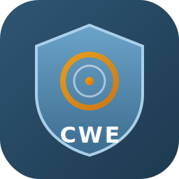
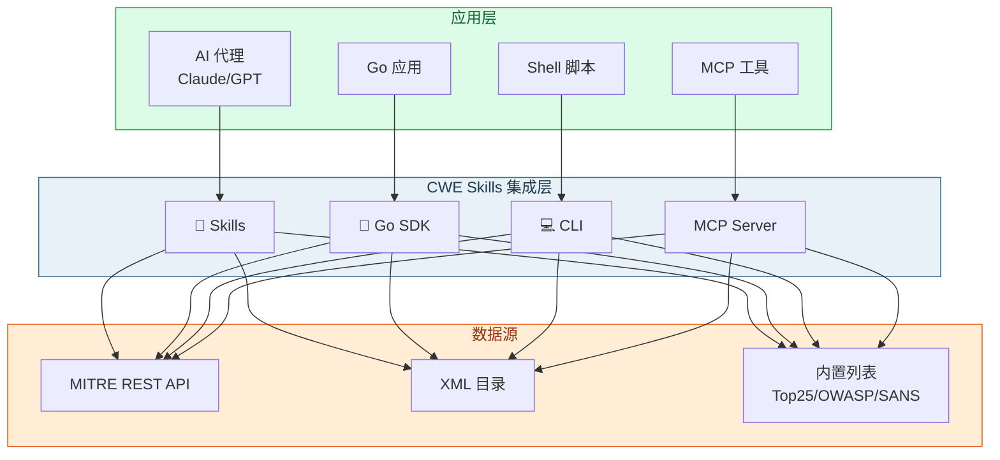
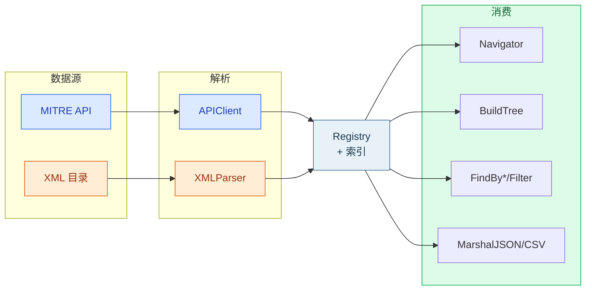
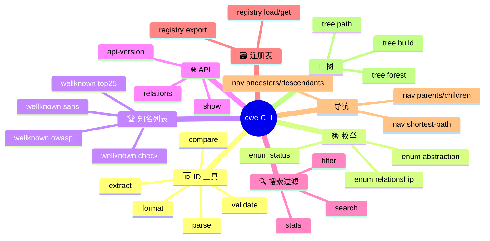

<p align="center">
  
</p>

<h1 align="center">CWE Skills — AI 原生的 CWE 集成</h1>

<p align="center">
  <a href="https://pkg.go.dev/github.com/scagogogo/cwe-skills"></a>
  <a href="https://github.com/scagogogo/cwe-skills/actions/workflows/ci.yml"></a>
  <a href="https://opensource.org/licenses/MIT"></a>
  <a href="https://scagogogo.github.io/cwe-skills/"></a>
</p>

<p align="center"><b>AI 原生的 <a href="https://cwe.mitre.org/">CWE（通用缺陷枚举）</a> 集成层</b> — 四种接入方式：<b>Skills</b>、Go SDK、CLI 和 MCP。</p>

<p align="center">🇬🇧 <a href="README.md">English</a> · 📖 <a href="https://scagogogo.github.io/cwe-skills/">文档站</a></p>

---

## 🚀 四种接入方式



| # | 方式 | 适用场景 | 一行安装 |
|---|------|---------|---------|
| 1 | **Skills** | AI代理（Claude、GPT等） | 复制下方提示词 |
| 2 | **Go SDK** | Go应用和库 | `go get github.com/scagogogo/cwe-skills` |
| 3 | **CLI** | Shell脚本和开发工作流 | 从 [Releases](https://github.com/scagogogo/cwe-skills/releases/latest) 下载 |
| 4 | **MCP** | MCP兼容的AI工具 | `go build ./cmd/cwe-mcp` |

---

## 1. Skills — AI代理接入

复制以下内容到你的AI代理系统提示词或技能配置中：

```markdown
## CWE Skills

你可以使用 `cwe` CLI工具进行CWE（通用缺陷枚举）操作。

### 安装
```bash
# 下载预编译二进制（Linux/macOS/Windows）
curl -sL https://github.com/scagogogo/cwe-skills/releases/latest/download/cwe-skills_latest_linux_x86_64.tar.gz | tar xz && sudo mv cwe /usr/local/bin/
# 或从源码编译：
git clone https://github.com/scagogogo/cwe-skills.git && cd cwe-skills && go build -o cwe ./cmd/cwe/ && sudo mv cwe /usr/local/bin/
```

### 核心命令
| 命令 | 功能 |
|------|------|
| `cwe parse CWE-79` | 解析CWE ID |
| `cwe validate CWE-79` | 验证CWE ID格式 |
| `cwe show CWE-79` | 从MITRE API获取弱点详情 |
| `cwe wellknown check CWE-79` | 检查是否在Top 25/OWASP/SANS列表 |
| `cwe enum abstraction` | 列出枚举值 |
| `cwe search --xml <file> --keyword Injection` | 搜索离线XML目录 |
| `cwe filter --xml <file> --abstraction Base --status Stable` | 多条件过滤 |
| `cwe registry get CWE-79 --xml <file>` | 从本地注册表获取条目 |
| `cwe nav ancestors CWE-79 --xml <file>` | 离线导航关系 |
| `cwe nav shortest-path CWE-79 CWE-1 --xml <file>` | 查找两个CWE间最短路径 |
| `cwe tree build CWE-1 --xml <file>` | 构建层次树 |
| `cwe stats --xml <file>` | XML目录统计 |

### 输出格式
所有命令支持 `-o json` 输出结构化JSON。示例: `cwe parse CWE-79 -o json`

### Go SDK
```go
import "github.com/scagogogo/cwe-skills"
id, _ := cweskills.ParseCWEID("CWE-79")
cweskills.IsInTop25(79) // true
client := cweskills.NewAPIClient()
weakness, _ := client.GetWeakness(ctx, 79)
```

### 技能文档
渐进式能力文档: https://github.com/scagogogo/cwe-skills/tree/main/docs/skills
```

---

## 2. Go SDK



```go
import (
    "context"
    "github.com/scagogogo/cwe-skills"
)

// 解析和验证CWE ID
id, _ := cweskills.ParseCWEID("CWE-79")
if cweskills.IsCWEID("CWE-89") { /* 有效 */ }

// 查询MITRE REST API
client := cweskills.NewAPIClient()
defer client.Close()
weakness, _ := client.GetWeakness(context.Background(), 79)
parents, _ := client.GetParents(context.Background(), 79)

// 从XML加载本地注册表
registry, _ := cweskills.NewXMLParser().ParseFile("cwec_v4.15.xml")
registry.BuildIndexes()

// 导航关系
nav := cweskills.NewNavigator(registry)
ancestors := nav.Ancestors(79)
path := nav.ShortestPath(79, 1)

// 构建层次树
tree := cweskills.BuildTree(registry, 1)
leaves := tree.LeafNodes()

// 搜索和过滤
results := cweskills.FindByKeyword(registry, "Injection")
filtered := cweskills.Filter(results, cweskills.FilterOption{
    Abstraction: cweskills.AbstractionBase,
    Status:      cweskills.StatusStable,
})

// 知名列表
cweskills.IsInTop25(79)       // true
cweskills.IsInOWASPTop10(79)  // true
cweskills.IsInSANSTop25(79)   // true

// 序列化
jsonData, _ := registry.ExportJSON()
csvData, _ := registry.ExportCSV()
```

**安装**: `go get github.com/scagogogo/cwe-skills`

---

## 3. CLI



### 安装

**从Release下载**（推荐）：
```bash
# Linux (amd64)
curl -sL https://github.com/scagogogo/cwe-skills/releases/latest/download/cwe-skills_latest_linux_x86_64.tar.gz | tar xz
sudo mv cwe /usr/local/bin/

# macOS (Apple Silicon)
curl -sL https://github.com/scagogogo/cwe-skills/releases/latest/download/cwe-skills_latest_darwin_aarch64.tar.gz | tar xz
sudo mv cwe /usr/local/bin/

# Windows (PowerShell)
Invoke-WebRequest -Uri https://github.com/scagogogo/cwe-skills/releases/latest/download/cwe-skills_latest_windows_x86_64.zip -OutFile cwe.zip
Expand-Archive cwe.zip
```

**从源码编译**：
```bash
git clone https://github.com/scagogogo/cwe-skills.git
cd cwe-skills && go build -o cwe ./cmd/cwe/
```

**包管理器**：
```bash
brew install scagogogo/tap/cwe-skills          # Homebrew
scoop install cwe-skills                         # Scoop (Windows)
go install github.com/scagogogo/cwe-skills/cmd/cwe@latest  # Go
```

### 快速示例

```bash
# CWE ID操作
cwe parse CWE-79 89 cwe-352
cwe validate CWE-79 CWE-89
cwe format 79 89 352
cwe extract "受CWE-79和CWE-89影响"
cwe compare CWE-79 CWE-89

# 知名列表
cwe wellknown top25
cwe wellknown owasp
cwe wellknown check CWE-79

# MITRE API（在线）
cwe show CWE-79
cwe relations parents CWE-79
cwe api-version

# 本地搜索和过滤（离线）
cwe search --xml cwec_latest.xml --keyword Injection --sort name
cwe filter --xml cwec_latest.xml --abstraction Base --status Stable --likelihood High

# 本地注册表（离线）
cwe registry load --xml cwec_latest.xml
cwe registry get CWE-79 --xml cwec_latest.xml
cwe registry ancestors CWE-79 --xml cwec_latest.xml
cwe registry export --xml cwec_latest.xml --format json

# 本地导航（离线）
cwe nav siblings CWE-79 --xml cwec_latest.xml
cwe nav peers CWE-79 --xml cwec_latest.xml
cwe nav shortest-path CWE-79 CWE-1 --xml cwec_latest.xml
cwe nav is-ancestor CWE-1 CWE-79 --xml cwec_latest.xml

# 树操作（离线）
cwe tree build CWE-1 --xml cwec_latest.xml
cwe tree forest --xml cwec_latest.xml
cwe tree path CWE-79 --xml cwec_latest.xml
cwe tree leaves CWE-1 --xml cwec_latest.xml

# 枚举类型
cwe enum abstraction
cwe enum status
cwe enum relationship

# 所有命令支持JSON输出
cwe parse CWE-79 -o json
cwe wellknown check CWE-79 -o json
```

### 命令参考

| 命令 | 描述 |
|------|------|
| `cwe version` | 显示版本信息 |
| `cwe parse/validate/format/extract/compare` | CWE ID工具 |
| `cwe enum <type>` | 列出枚举值 |
| `cwe wellknown top25/owasp/sans/check` | 知名列表 |
| `cwe show [IDs...]` | 从MITRE API获取 |
| `cwe relations parents/children/ancestors/descendants` | API关系查询 |
| `cwe api-version` | 检查MITRE API版本 |
| `cwe search --xml <file> [flags]` | 搜索离线XML |
| `cwe filter --xml <file> [flags]` | 多条件过滤 |
| `cwe stats --xml <file>` | 统计数据 |
| `cwe registry <subcmd> --xml <file>` | 注册表操作 |
| `cwe nav <subcmd> --xml <file>` | 关系导航 |
| `cwe tree <subcmd> --xml <file>` | 树操作 |

---

## 4. MCP

`cwe-mcp` 服务器通过 stdio/SSE 暴露 15 个工具（parse、validate、extract、get_weakness、get_ancestors、build_tree、search_keyword 等），供 Claude Desktop 等 MCP 兼容 AI 工具调用。

```bash
# 构建
go build -o cwe-mcp ./cmd/cwe-mcp/

# 运行（stdio 模式，供本地客户端）
./cwe-mcp --xml cwec_v4.15.xml

# 运行（SSE 模式，远程）
./cwe-mcp --transport http --addr :8080
```

配置 Claude Desktop（`claude_desktop_config.json`）：
```json
{
  "mcpServers": {
    "cwe-skills": {
      "command": "/path/to/cwe-mcp",
      "args": ["--xml", "/path/to/cwec_v4.15.xml"]
    }
  }
}
```

→ **[MCP 接入指南](https://scagogogo.github.io/cwe-skills/guide/integration-mcp)**

---

## Skills技能文档

渐进式技能文档，面向AI代理和开发者 — 从简到深：

| # | 技能 | 描述 |
|---|------|------|
| 1 | [CWE ID 解析与验证](docs/skills/01-cwe-id-parsing-validation.md) | 解析、验证、格式化CWE ID |
| 2 | [CWE ID 提取与比较](docs/skills/02-cwe-id-extraction-comparison.md) | 从文本提取、比较ID |
| 3 | [知名列表](docs/skills/03-well-known-lists.md) | CWE Top 25、OWASP Top 10、SANS Top 25 |
| 4 | [枚举类型](docs/skills/04-enumeration-types.md) | 抽象层级、状态、关系类型 |
| 5 | [API: 获取弱点详情](docs/skills/05-api-show-weakness.md) | 从MITRE API获取 |
| 6 | [API: 关系查询](docs/skills/06-api-relationships.md) | 通过API查询关系 |
| 7 | [API: 版本检查](docs/skills/07-api-version.md) | 检查MITRE API版本 |
| 8 | [本地: 搜索与过滤](docs/skills/08-local-search-filter.md) | 搜索和多条件过滤 |
| 9 | [本地: 注册表操作](docs/skills/09-local-registry.md) | 加载、查询、导出本地数据 |
| 10 | [本地: 关系导航](docs/skills/10-local-navigation.md) | 离线导航关系 |
| 11 | [本地: 树构建](docs/skills/11-local-tree.md) | 构建和遍历层次树 |
| 12 | [SDK: 序列化](docs/skills/12-sdk-serialization.md) | JSON、XML、CSV导入导出 |

→ **[完整技能索引](docs/skills/README.md)**

## 支持平台

预编译二进制支持30+平台: Linux (amd64/386/arm64/arm/mips/ppc64/s390x/riscv64), macOS (Intel/Apple Silicon), Windows (amd64/386/arm64), FreeBSD, NetBSD, OpenBSD, AIX, Illumos, Solaris。

## 功能特性

- **完整CWE数据模型**：弱点、类别、视图、复合元素
- **类型化枚举**：抽象层级、状态、关系类型、后果范围、视图类型
- **CWE ID工具**：解析、格式化、验证、提取、比较
- **知名列表**：CWE Top 25、OWASP Top 10、SANS Top 25
- **MITRE REST API客户端**：速率限制、重试、结构化错误
- **XML目录解析器**：离线MITRE XML解析
- **内存注册表**：存储、索引、查询及关系索引
- **搜索与过滤**：关键字、抽象层级、状态、可能性、范围、排序、分组
- **关系导航**：父/子/祖先/后代/同级/对等/链式/组合/最短路径/关系深度
- **树构建**：构建、遍历、查找路径、列出叶子
- **序列化**：JSON、XML、CSV导入导出
- **40+ CLI子命令**：text/JSON双格式输出
- **零依赖**：核心SDK仅使用Go标准库

## 许可证

MIT许可证 - 详见 [LICENSE](LICENSE)
