# 🧭 cwe nav

基于本地 XML 数据的关系导航，提供比 API 更丰富的关系查询。

<Badge type="tip" text="离线"/> 所有 `nav` 子命令都需要通过 `--xml` 指定 CWE XML 目录文件。

## 语法

```bash
cwe nav <子命令> [CWE-ID...] [flags]
```

## 子命令

```mermaid
flowchart TD
    NAV["cwe nav"]

    subgraph HIER["层级关系"]
        H1["parents"]
        H2["children"]
        H3["ancestors"]
        H4["descendants"]
        H5["siblings"]
    end

    subgraph PEER["对等关系"]
        P1["peers"]
        P2["can-also-be"]
    end

    subgraph SEQ["顺序/依赖"]
        S1["precede"]
        S2["follow"]
        S3["requires"]
        S4["required-by"]
    end

    subgraph COMP["复合/路径"]
        C1["chain-members"]
        C2["composite-members"]
        C3["shortest-path"]
        C4["is-ancestor"]
        C5["is-related"]
        C6["depth"]
    end

    NAV --> H1 & H2 & H3 & H4 & H5
    NAV --> P1 & P2
    NAV --> S1 & S2 & S3 & S4
    NAV --> C1 & C2 & C3 & C4 & C5 & C6

    classDef core fill:#e8f1f8,stroke:#3c6c8f,color:#1d3a4f
    classDef local fill:#dcfce7,stroke:#16a34a,color:#166534
    class NAV core
    class HIER,PEER,SEQ,COMP local
```



### 层级关系

| 子命令 | 说明 |
| --- | --- |
| [`parents`](./nav-parents) | 父级弱点 |
| [`children`](./nav-children) | 子级弱点 |
| [`ancestors`](./nav-ancestors) | 所有祖先弱点 |
| [`descendants`](./nav-descendants) | 所有后代弱点 |
| [`siblings`](./nav-siblings) | 同级弱点（同一父级的其他子级） |

### 对等关系

| 子命令 | 说明 |
| --- | --- |
| [`peers`](./nav-peers) | 对等弱点 |
| [`can-also-be`](./nav-can-also-be) | 此弱点也可以是的弱点 |

### 顺序与依赖关系

| 子命令 | 说明 |
| --- | --- |
| [`precede`](./nav-precede) | 此弱点可前置的弱点 |
| [`follow`](./nav-follow) | 此弱点可跟随的弱点 |
| [`requires`](./nav-requires) | 此弱点所依赖的弱点 |
| [`required-by`](./nav-required-by) | 依赖此弱点的弱点 |

### 复合与路径查询

| 子命令 | 说明 |
| --- | --- |
| [`chain-members`](./nav-chain-members) | 链式弱点的成员 |
| [`shortest-path`](./nav-shortest-path) | 两个 CWE 间的最短路径 |
| [`is-ancestor`](./nav-is-ancestor) | 检查是否为祖先关系 |

::: details 源码中还有这些子命令
- `composite-members [CWE-ID]` — 复合弱点的成员
- `is-related <CWE-ID1> <CWE-ID2>` — 检查两个 CWE 是否有关系
- `depth <FROM> <TO>` — 计算两个 CWE 间的关系深度
:::

## Flags

`nav` 的 `PersistentFlags`，对所有子命令生效：

| Flag | 简写 | 默认值 | 说明 |
| --- | --- | --- | --- |
| `--xml` | `-x` | （必填） | CWE XML 目录文件路径 |

## 示例

### 查询同级

```bash
cwe nav siblings CWE-79 --xml cwec_latest.xml
```

```text
CWE-79 的 同级 (N 项):
  CWE-89 - ...
  ...
```

### 最短路径

```bash
cwe nav shortest-path CWE-79 CWE-1 --xml cwec_latest.xml
```

```text
最短路径 (3 步):
  1. CWE-79
  2. CWE-74
  3. CWE-1
```

### JSON 输出

```bash
cwe nav is-ancestor CWE-1 CWE-79 --xml cwec_latest.xml -o json
```

```json
{ "ancestor": "CWE-1", "descendant": "CWE-79", "is_ancestor": true }
```

## 使用场景

- 深度探索 CWE 关系网络，超越单纯父子层级。
- 路径分析：查找两个弱点间的最短关系链。
- 祖先/依赖/顺序关系的离线分析。

::: tip 与 registry 的区别
[`registry`](./registry) 只提供基础的父子/祖孙查询且返回 ID；`nav` 返回完整 CWE 对象，并支持 siblings/peers/precede/follow/requires/shortest-path 等更丰富的关系类型。
:::

## 下一步

- [nav siblings](./nav-siblings) — 常用同级查询。
- [nav shortest-path](./nav-shortest-path) — 路径分析。
- [nav is-ancestor](./nav-is-ancestor) — 祖先判定。

## 相关文档

- [SDK Navigator](../sdk/navigator)
- [SDK 构建索引](../sdk/build-indexes)
- [关系概念](../guide/concept-relationship)
