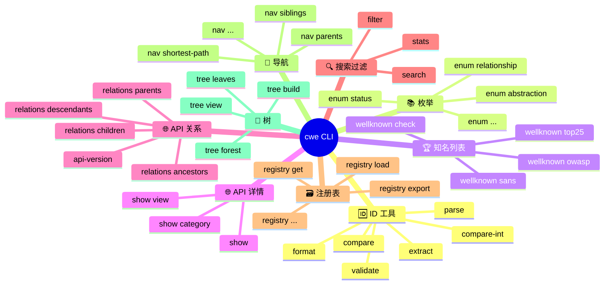

# 💻 CWE CLI 总览

`cwe` 是 CWE Skills 提供的命令行工具，基于 [github.com/scagogogo/cwe-skills](https://github.com/scagogogo/cwe-skills) SDK 构建，使用 [cobra](https://github.com/spf13/cobra) 框架。它将 SDK 的核心能力——CWE ID 工具、枚举、知名列表、MITRE REST API、离线 XML 解析与导航——封装为一组可在终端直接使用的子命令。

## 设计目标

- **离线优先**：解析 MITRE 官方 XML 目录，构建内存注册表与多层索引，零网络依赖。
- **在线补充**：通过 MITRE CWE REST API 获取弱点详情与关系。
- **结构化输出**：每条命令均支持 `text`（人类可读）与 `json`（机器可读）两种输出。
- **管道友好**：JSON 输出可被 `jq` 等工具消费，便于脚本编排。

## 命令结构



## 能力分类

<Badge type="tip" text="离线"/> 标记的命令需要本地 XML 目录文件（通过 `--xml` 指定），可从 [cwe.mitre.org/data/xml.html](https://cwe.mitre.org/data/xml.html) 下载；<Badge type="info" text="在线"/> 标记的命令需要访问 MITRE API。

| 分类 | 命令 | 模式 |
| --- | --- | --- |
| 🆔 ID 工具 | `parse` `validate` `format` `extract` `compare` `compare-int` | 纯本地 |
| 📚 枚举 | `enum abstraction` `enum status` ... | 纯本地 |
| 🏆 知名列表 | `wellknown top25` `wellknown owasp` `wellknown sans` `wellknown check` | 纯本地 |
| 🌐 API 详情 | `show` `show category` `show view` | <Badge type="info" text="在线"/> |
| 🌐 API 关系 | `relations parents/children/ancestors/descendants` `api-version` | <Badge type="info" text="在线"/> |
| 🔍 搜索过滤 | `search` `filter` `stats` | <Badge type="tip" text="离线"/> |
| 🗃️ 注册表 | `registry load/get/contains/export/...` | <Badge type="tip" text="离线"/> |
| 🧭 导航 | `nav parents/siblings/peers/shortest-path/...` | <Badge type="tip" text="离线"/> |
| 🌳 树 | `tree build/forest/view/path/leaves` | <Badge type="tip" text="离线"/> |

## 快速示例

```bash
# 解析多种写法的 CWE ID
cwe parse CWE-79 89 cwe-352

# 检查某 CWE 是否在高风险列表中
cwe wellknown check CWE-79

# 在线获取弱点详情
cwe show CWE-89

# 离线搜索并按名称排序
cwe search --xml cwec_latest.xml --keyword Injection --sort name

# 查找两个 CWE 间的最短路径
cwe nav shortest-path CWE-79 CWE-1 --xml cwec_latest.xml
```

::: tip 输出格式
所有命令均接受全局参数 `-o json` 以输出结构化 JSON，详见 [全局参数](./global-flags)。
:::

## 下一步

- [安装](./install) — 获取并安装 `cwe` 二进制。
- [全局参数](./global-flags) — 了解 `-o/--output` 等通用选项。
- 按上表分类进入具体命令文档。

## 相关文档

- [SDK 总览](../sdk/overview)
- [快速开始](../guide/quick-start)
- [CWE 概念](../guide/concept-cwe)
