# 🗃️ cwe registry

对本地 CWE 注册表进行操作，包括加载 XML、查询、导出等。

<Badge type="tip" text="离线"/> 所有 `registry` 子命令都需要通过 `--xml` 指定 CWE XML 目录文件。

## 语法

```bash
cwe registry <子命令> [flags]
```

## 子命令

```mermaid
flowchart TD
    REG["cwe registry"]

    subgraph LOAD["加载/查询"]
        L1["load\n加载XML"]
        L2["get\n获取条目"]
        L3["contains\n检查存在"]
    end

    subgraph LIST["列表"]
        LA["list-views\n列出视图"]
        LB["list-categories\n列出类别"]
    end

    subgraph REL["关系"]
        R1["parents\n父级"]
        R2["children\n子级"]
        R3["ancestors\n祖先"]
        R4["descendants\n后代"]
        R5["peers\n对等"]
    end

    subgraph MEM["成员"]
        M1["view-members"]
        M2["category-members"]
        M3["member-of"]
    end

    subgraph EXPORT["导出"]
        E1["export\nJSON/CSV"]
    end

    REG --> L1 & L2 & L3
    REG --> LA & LB
    REG --> R1 & R2 & R3 & R4 & R5
    REG --> M1 & M2 & M3
    REG --> E1

    classDef core fill:#e8f1f8,stroke:#3c6c8f,color:#1d3a4f
    classDef local fill:#dcfce7,stroke:#16a34a,color:#166534
    class REG core
    class LOAD,LIST,REL,MEM,EXPORT local
```



| 子命令 | 说明 |
| --- | --- |
| [`load`](./registry-load) | 加载 XML 目录并显示概要 |
| [`get`](./registry-get) | 获取单个 CWE 条目详情 |
| [`contains`](./registry-contains) | 检查 CWE ID 是否存在 |
| [`list-views`](./registry-list-views) | 列出所有视图 |
| [`list-categories`](./registry-list-categories) | 列出所有类别 |
| [`parents`](./registry-relations) | 查询本地父级关系 |
| [`children`](./registry-relations) | 查询本地子级关系 |
| [`ancestors`](./registry-anc-desc) | 查询所有祖先关系 |
| [`descendants`](./registry-anc-desc) | 查询所有后代关系 |
| [`export`](./registry-export) | 导出注册表为 JSON/CSV |

::: details 完整子命令清单（含未单独成篇）
源码中还注册了以下子命令，本文档未为其单独创建页面，但可通过 `cwe registry <子命令> --xml <file>` 使用：

- `peers [CWE-ID]` — 查询本地对等关系
- `view-members [VIEW-ID]` — 查询视图成员列表
- `category-members [CATEGORY-ID]` — 查询类别成员列表
- `member-of [CWE-ID]` — 查询 CWE 所属的类别和视图
:::

## Flags

`registry` 的 `PersistentFlags`，对所有子命令生效：

| Flag | 简写 | 默认值 | 说明 |
| --- | --- | --- | --- |
| `--xml` | `-x` | （必填） | CWE XML 目录文件路径 |

## 示例

### 加载并查看概要

```bash
cwe registry load --xml cwec_latest.xml
```

```text
已加载CWE注册表:
  弱点:     1400+
  类别:     300+
  视图:     40+
  复合元素: N
  索引:     true
```

### 获取条目详情

```bash
cwe registry get CWE-79 --xml cwec_latest.xml
```

### 检查存在性

```bash
cwe registry contains CWE-79 CWE-999 --xml cwec_latest.xml
```

## 使用场景

- 离线、零网络依赖地查询 CWE 数据。
- 一次性加载 XML 后多次查询（每次子命令调用都会重新解析，因此大批量查询建议导出后用脚本处理）。
- 作为 [`nav`](./nav)、[`tree`](./tree) 的基础数据源。

::: tip 与 nav/tree 的关系
`registry` 提供基础查询；[`nav`](./nav) 在其之上提供更丰富的关系导航（siblings/peers/shortest-path 等）；[`tree`](./tree) 提供层次树构建。三者共享相同的 XML 解析逻辑。
:::

## 下一步

- [registry load](./registry-load)
- [registry get](./registry-get)
- [registry export](./registry-export)

## 相关文档

- [SDK Registry](../sdk/registry)
- [SDK XML 解析器](../sdk/xml-parser)
- [SDK 构建索引](../sdk/build-indexes)
