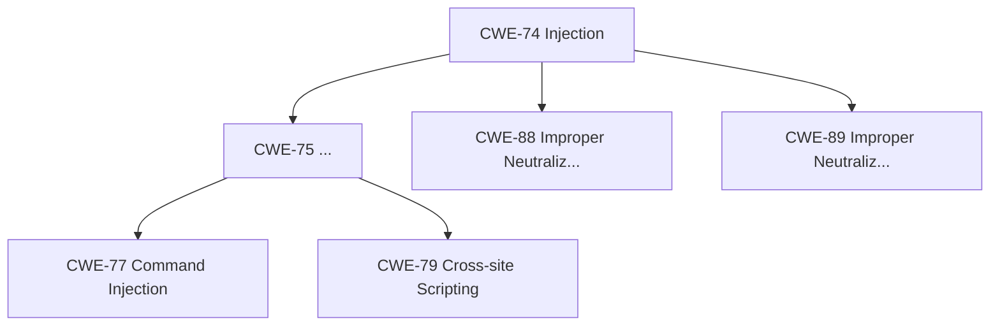

# 🌳 实战 — 树可视化

从 XML 目录构建 CWE 森林，遍历生成 Mermaid 流程图与 ASCII 缩进树，用于文档与演示。

<Badge type="tip" text="SDK 实战"/>
<Badge type="info" text="离线"/>

---

## 🎬 场景

要在内部 Wiki 展示 CWE 层次结构：一棵 Mermaid 图（Wiki 支持）+ 一棵 ASCII 树（终端/Markdown 可读）。

---

## 📋 前置准备

```bash
curl -O https://cwe.mitre.org/data/xml/cwec_latest.xml.zip
unzip cwec_latest.xml.zip

go get github.com/scagogogo/cwe-skills
```

---

## 💻 完整代码

```go
package main

import (
    "fmt"
    "os"
    "strings"

    "github.com/scagogogo/cwe-skills"
)

func main() {
    registry, err := cweskills.NewXMLParser().ParseFile("cwec_latest.xml")
    if err != nil {
        panic(err)
    }
    registry.BuildIndexes()

    // 1. 从 CWE-74（注入）构建子树，限制深度避免过大
    rootID := 74
    tree := cweskills.BuildTree(registry, rootID)

    // 2. 生成 ASCII 缩进树
    var ascii strings.Builder
    ascii.WriteString(fmt.Sprintf("CWE 层次树（根: CWE-%d）\n", rootID))
    tree.Walk(func(n *cweskills.TreeNode) bool {
        if n.Depth > 3 {
            return false // 剪枝：只展示到第 3 层
        }
        prefix := strings.Repeat("  ", n.Depth)
        name := n.CWE.Name
        if len(name) > 50 {
            name = name[:47] + "..."
        }
        ascii.WriteString(fmt.Sprintf("%s├─ CWE-%d %s\n", prefix, n.CWE.ID, name))
        return true
    })
    os.WriteFile("cwe_tree.txt", []byte(ascii.String()), 0644)

    // 3. 生成 Mermaid 流程图
    var mmd strings.Builder
    mmd.WriteString("graph TD\n")
    tree.Walk(func(n *cweskills.TreeNode) bool {
        if n.Depth > 3 {
            return false
        }
        for _, child := range n.Children {
            mmd.WriteString(fmt.Sprintf("    CWE%d[\"CWE-%d %s\"] --> CWE%d[\"CWE-%d %s\"]\n",
                n.CWE.ID, n.CWE.ID, short(n.CWE.Name),
                child.CWE.ID, child.CWE.ID, short(child.CWE.Name)))
        }
        return true
    })
    os.WriteFile("cwe_tree.mmd", []byte(mmd.String()), 0644)

    fmt.Println("已生成: cwe_tree.txt, cwe_tree.mmd")
}

func short(s string) string {
    s = strings.ReplaceAll(s, "\"", "'")
    if len(s) > 30 {
        return s[:27] + "..."
    }
    return s
}
```

---

## ▶️ 运行步骤

```bash
go run main.go

# 看文本树
head -20 cwe_tree.txt

# Mermaid 可在 GitHub/GitLab/Wiki 渲染，例如写进 Markdown：
# ```mermaid
# <cwe_tree.mmd 内容>
# ```
```

---

## 📤 输出示例

`cwe_tree.txt`（截断）：

```text
CWE 层次树（根: CWE-74）
├─ CWE-74 Injection
  ├─ CWE-75 Improper Neutralization of Special Elements...
    ├─ CWE-77 Improper Neutralization of Special Elements used in a Command...
    ├─ CWE-79 Improper Neutralization of Input During Web Page...
  ├─ CWE-88 Improper Neutralization of Argument Delimiters in a Command...
  ├─ CWE-89 Improper Neutralization of Special Elements used in an SQL...
```

`cwe_tree.mmd`（Mermaid）：



---

## 🧩 扩展思路

- **整片森林**：用 `BuildForest(registry)` 遍历所有柱状根节点，生成完整体系图。
- **视图树**：用 `BuildViewTree(registry, 1000)` 只画 Research Concepts 视图的层次。
- **路径高亮**：用 `tree.Find(79).Path()` 取路径，在图里高亮从根到目标 CWE 的链路。
- **交互式**：把 Mermaid 嵌入 HTML，配合 `tree.LeafNodes()` 列出叶子做导航。
- **导出 Graphviz**：把 Mermaid 改成 DOT 格式，用 `dot` 渲染成 PNG/SVG。

::: tip 剪枝控制规模
完整 CWE 树很大（上千节点）。用 `Walk` 回调里按 `n.Depth` 剪枝，或按子节点数采样，控制输出规模。
:::

---

## 📖 相关文档

- [技能 11 — 本地树构建](../skills/11-local-tree) · [技能 12 — 序列化](../skills/12-sdk-serialization)
- [SDK: BuildTree](../sdk/build-tree) · [BuildForest](../sdk/build-forest) · [Walk](../sdk/tree-walk) · [Path](../sdk/tree-path)
- [返回示例总览](./)
