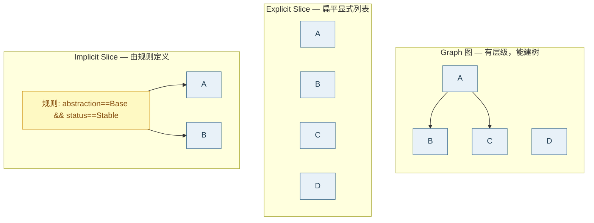

# 🗺️ 视图 (View)

CWE 目录里有上千条条目，不同受众关心的子集不同。**视图（View）**就是「从某个视角看 CWE 体系」的切片——它把条目重新组织成适合特定受众（安全研究者、软件开发者、硬件设计者）的结构。

---

## 📦 View 结构

```go
type View struct {
    ID            int          // 视图数字标识符
    Name          string       // 视图名称
    Type          ViewType     // 视图类型 Graph/Explicit Slice/Implicit Slice
    Status        Status       // 状态
    Description   string       // 描述
    Members       []ViewMember // 成员列表
    References    []Reference  // 参考文献
    ContentHistory *ContentHistory
}

type ViewMember struct {
    CWEID     int    // 成员的 CWE ID
    ViewID    int    // 所属视图 ID
    Direct    bool   // 是否直接成员
    Predicate string // 谓词（可选）
}
```

```go
view, ok := registry.GetView(cweskills.CWEViewResearchConcepts)
fmt.Println(view.Name, view.Type, len(view.Members))
```

---

## 🏷️ 三种视图类型

`ViewType` 描述视图的组织方式：

```go
const (
    ViewTypeGraph         ViewType = "Graph"           // 图：层次化关系
    ViewTypeExplicitSlice ViewType = "Explicit Slice"  // 显式切片：扁平列表
    ViewTypeImplicitSlice ViewType = "Implicit Slice"  // 隐式切片：按过滤器定义
)
```

| 类型 | 含义 | 结构 | 典型代表 |
|------|------|------|---------|
| **Graph** | 层次化的关系表示 | 树/图 | CWE-1000 研究概念、CWE-699 软件开发 |
| **Explicit Slice** | 与外部因素相关的扁平列表 | 列表 | CWE-888 横截面、CWE-1400 综合字典 |
| **Implicit Slice** | 由过滤器/属性定义的扁平列表 | 列表（动态） | 按属性筛选的视图 |



::: tip Graph 视图可建树
`BuildViewTree(registry, viewID)` 依据 Graph 视图的层级关系构建树。Explicit/Implicit Slice 是扁平列表，通常不建树，而是作为成员集合使用。
:::

```go
cweskills.ViewTypeGraph.IsValid()                  // true
vt, _ := cweskills.ParseViewType("Explicit Slice") // ViewTypeExplicitSlice
cweskills.AllViewTypeValues()                      // 3 个
```

---

## 🏆 知名视图

CWE Skills 内置 5 个知名视图的 ID 常量，定义在 `wellknown_ids.go`：

```go
const (
    CWEViewResearchConcepts         = 1000  // 研究概念视图
    CWEViewDevelopmentConcepts      = 699   // 软件开发视图
    CWEViewHardwareDesign           = 1199  // 硬件设计视图
    CWEViewCWECrossSection          = 888   // CWE 横截面视图
    CWEViewComprehensiveDictionary  = 1400  // 综合CWE字典
)
```

| 视图 ID | 名称 | 类型 | 用途 |
|--------|------|------|------|
| **CWE-1000** | 研究概念 (Research Concepts) | Graph | 按抽象概念组织的完整层次结构，研究者视角 |
| **CWE-699** | 软件开发 (Development Concepts) | Graph | 按开发活动组织，开发者视角 |
| **CWE-1199** | 硬件设计 (Hardware Design) | Graph | 按硬件设计活动组织，硬件工程师视角 |
| **CWE-888** | CWE 横截面 (CWE Cross-Section) | Explicit Slice | 横截面切片 |
| **CWE-1400** | 综合 CWE 字典 (Comprehensive Dictionary) | Explicit Slice | 包含所有条目的综合字典 |

::: info IsInWellKnownView
`cweskills.IsInWellKnownView(viewID)` 可判断某个视图 ID 是否属于上述知名视图集合，便于快速校验。
:::

---

## 🔍 查询视图成员

```go
// 取某视图的全部成员 CWE ID
memberIDs := registry.GetViewMembers(cweskills.CWEViewResearchConcepts)

// 取某条目所属的视图/类别
memberOf := registry.GetMemberOfIDs(79)

// 判断 79 是否在研究概念视图里
for _, id := range memberIDs {
    if id == 79 { /* 是 */ }
}
```

::: details 直接成员 vs 间接成员
`ViewMember.Direct` 标识成员是否为视图的**直接**成员。Graph 视图里，直接成员是显式列出的节点，间接成员是通过层级关系推导出的后代。`GetViewMembers` 通常返回所有成员（含直接与间接）。
:::

---

## 🌳 为视图建树

Graph 视图可构建层次树：

```go
// 为研究概念视图建树
viewTree := cweskills.BuildViewTree(registry, cweskills.CWEViewResearchConcepts)
fmt.Println("根:", viewTree.CWE.CWEID())
fmt.Println("叶子数:", len(viewTree.LeafNodes()))

// DFS 遍历
viewTree.Walk(func(n *cweskills.TreeNode) bool {
    fmt.Printf("%s%s %s\n", strings.Repeat("  ", n.Depth), n.CWE.CWEID(), n.CWE.Name)
    return true
})
```

::: warning BuildViewTree 仅对 Graph 视图有意义
Explicit/Implicit Slice 是扁平列表，建树没有层级含义。对这类视图，用 `GetViewMembers` 取成员列表即可。
:::

---

## 💻 CLI 操作

```bash
# 列出所有视图
cwe registry list-views --xml cwec_v4.15.xml

# 查看某视图成员
cwe registry view-members 1000 --xml cwec_v4.15.xml

# 查看某条目所属视图/类别
cwe registry member-of CWE-79 --xml cwec_v4.15.xml
```

---

## 🎯 用途

### 1. 按受众裁剪 CWE 集

- 给开发团队培训 → 用 CWE-699（软件开发视图）
- 给硬件团队 → 用 CWE-1199（硬件设计视图）
- 做学术研究 → 用 CWE-1000（研究概念视图）

### 2. 范围限定

扫描器/工具只关心某视图内的 CWE 时，用视图成员做白名单：

```go
allowed := registry.GetViewMembers(cweskills.CWEViewDevelopmentConcepts)
allowedSet := map[int]bool{}
for _, id := range allowed { allowedSet[id] = true }
// 只报告 allowedSet 里的 CWE
```

### 3. 层次展示

Graph 视图建树后，可做交互式 CWE 浏览器或报告里的层级目录。

---

## 📖 相关文档

- [类别 (Category)](./concept-category) — 非层级的另一种分组
- [层次树构建 API](../sdk/tree)
- [注册表 API](../sdk/registry)
- [ViewType 枚举参考](../enums/view-type)
