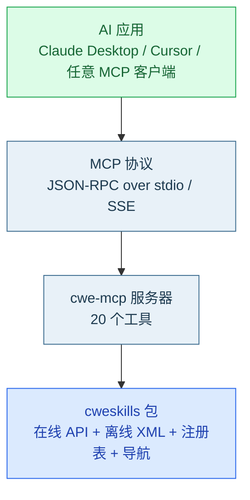
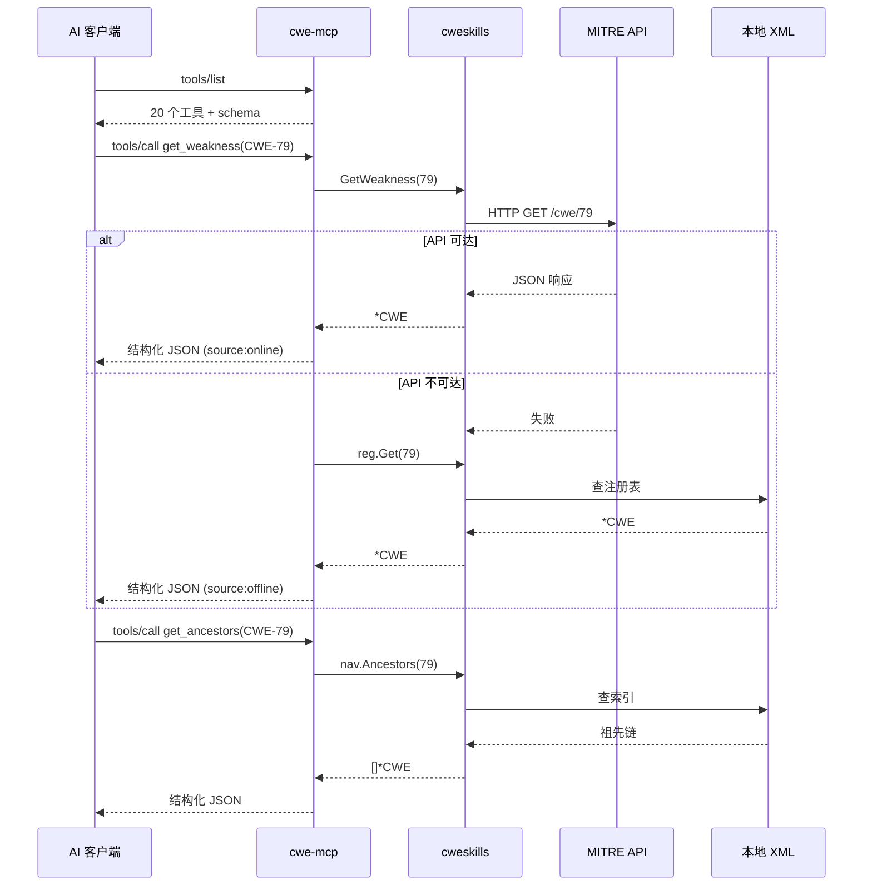

# 🌐 MCP 接入

**MCP**（Model Context Protocol）是 AI 工具调用的标准化协议。CWE Skills 提供官方 MCP 服务器 `cwe-mcp`，让任何 MCP 兼容的 AI 工具（Claude Desktop、Cursor 等）能以「工具调用」方式访问全部 CWE 能力——无需 AI 自己跑 Shell 命令、无需解析 CLI 文本输出。

<Badge type="tip" text="已实现" /> <Badge type="info" text="stdio + SSE" /> <Badge type="warning" text="20 个工具" />

::: tip 已发布
MCP 服务器 `cwe-mcp` 已实现，暴露 **20 个工具**，覆盖 ID 工具、知名列表、在线 API、离线 XML 导航/树/搜索/过滤。支持 stdio（本地客户端）与 SSE（远程）两种传输。
:::

---

## 🤔 什么是 MCP

MCP（Model Context Protocol）是一个开放协议，为 AI 应用与外部数据源/工具之间提供**标准化通信**。类比 USB-C：不管什么厂商的 AI 工具，只要支持 MCP，就能统一地「发现并调用」一个 MCP 服务器暴露的能力。



::: info MCP 的核心概念
- **工具（Tool）**：服务器暴露的可调用函数，带 JSON Schema 描述参数。
- **资源（Resource）**：服务器暴露的数据源（如只读的 CWE 注册表）。
- **提示（Prompt）**：服务器提供的预设提示词模板。
- **传输**：stdio（本地）或 SSE/HTTP（远程）。
:::

---

## 🚀 安装与启动

### 构建

```bash
git clone https://github.com/scagogogo/cwe-skills.git
cd cwe-skills
go build -o cwe-mcp ./cmd/cwe-mcp/
```

### 启动（stdio 模式 — 本地客户端）

```bash
# 仅在线工具（无需 XML）
./cwe-mcp

# 含离线工具（需指定 XML 目录）
./cwe-mcp --xml cwec_v4.15.xml
```

### 启动（SSE 模式 — 远程）

```bash
./cwe-mcp --transport http --addr :8080 --xml cwec_v4.15.xml
# 服务器监听 http://localhost:8080
```

### 配置 Claude Desktop

编辑 `claude_desktop_config.json`：

```json
{
  "mcpServers": {
    "cwe-skills": {
      "command": "/path/to/cwe-mcp",
      "args": ["--xml", "/path/to/cwec_v4.15.xml"]
    }
  }
}
```

重启 Claude Desktop 后，AI 即可自动发现并调用 20 个 CWE 工具。

---

## 🛠️ 工具清单

MCP 服务器暴露 20 个工具，与 CLI 子命令一一对应：

### 🆔 ID 工具（纯本地）

| 工具 | 对应 CLI | 能力 |
|------|----------|------|
| `parse_cwe_id` | `cwe parse` | 解析 CWE ID |
| `validate_cwe_id` | `cwe validate` | 验证 ID 格式 |
| `format_cwe_id` | `cwe format` | 整数 ID 格式化为 CWE-NNN |
| `extract_cwe_ids` | `cwe extract` | 从文本提取 ID |
| `compare_cwe_ids` | `cwe compare` | 比较两个 ID |

### 🏆 知名列表（纯本地）

| 工具 | 对应 CLI | 能力 |
|------|----------|------|
| `check_wellknown` | `cwe wellknown check` | Top 25/OWASP/SANS 检查 |
| `get_owasp_categories` | — | 查询 OWASP 类别 |

### 🌐 在线 API 工具

| 工具 | 对应 CLI | 能力 |
|------|----------|------|
| `get_weakness` | `cwe show` | 在线取弱点详情，API 不可达时回退到离线 XML |
| `get_parents` | `cwe relations parents` | 在线父级关系 |
| `api_version` | `cwe api-version` | MITRE API 版本 |

### 📥 离线 XML 工具（需 `--xml`）

| 工具 | 对应 CLI | 能力 |
|------|----------|------|
| `get_ancestors` | `cwe nav ancestors` | 祖先链 |
| `get_descendants` | `cwe nav descendants` | 后代 |
| `get_parents` (离线) / `get_children` | `cwe nav parents/children` | 直接父/子级 |
| `get_siblings` | `cwe nav siblings` | 同级 |
| `get_shortest_path` | `cwe nav shortest-path` | 最短路径 |
| `is_ancestor` | `cwe nav is-ancestor` | 祖先判定 |
| `build_tree` | `cwe tree build` | 层次树构建 |
| `search_keyword` | `cwe search` | 关键词搜索 |
| `filter_cwes` | `cwe filter` | 多条件过滤（abstraction/status） |
| `registry_stats` | `cwe stats` | 注册表统计 |

::: tip 工具命名与 CLI 对齐
熟悉 CLI 的用户能秒懂 MCP 工具。每个工具的参数与返回都是结构化 JSON，带 JSON Schema，AI 不用猜参数。
:::

---

## 📊 工具调用流程



---

## 🆚 MCP vs Skills vs CLI

| 维度 | MCP | Skills | CLI |
|------|-----|--------|-----|
| **AI 调用方式** | 工具调用（JSON-RPC） | 跑 Shell 命令 | 跑 Shell 命令 |
| **参数格式** | 结构化 JSON + schema | 字符串 | 字符串 |
| **返回格式** | 结构化 JSON | text/JSON | text/JSON |
| **需要 Shell** | ❌ 不需要 | ✅ 需要 | ✅ 需要 |
| **沙箱可用** | ✅ 是 | ❌ 否 | ❌ 否 |
| **跨语言** | ✅ 是 | ✅ 是 | ✅ 是 |
| **能力发现** | 自动（tools/list） | 需提示词 | 需文档 |
| **进程模型** | 长驻进程 | 每次 spawn | 每次 spawn |

::: tip 一句话总结
Skills 让 AI「跑命令」用 CWE，MCP 让 AI「调工具」用 CWE——后者更标准、更安全、更适配受限环境。
:::

---

## 🔧 命令行参数

```bash
./cwe-mcp [flags]
```

| Flag | 默认值 | 说明 |
|------|--------|------|
| `--transport` | `stdio` | 传输方式：`stdio` 或 `http`（SSE） |
| `--addr` | `:8080` | HTTP 模式监听地址 |
| `--xml` | （空） | CWE XML 目录文件路径（离线工具需要） |
| `--version` | `false` | 显示版本信息并退出 |

---

## ⚠️ 注意事项

::: warning 离线工具需 XML
`get_ancestors` / `build_tree` / `search_keyword` 等离线工具需要启动时指定 `--xml <file>`。未指定时调用会返回明确的错误提示，不会崩溃。
:::

::: info 在线工具受速率限制
`get_weakness` / `get_parents` / `api_version` 调用 MITRE API，受速率限制（~0.1 req/s）。SDK 内部自动等待与重试。
:::

::: tip 在线 + 离线组合
MCP 服务器可同时启用在线与离线工具。`get_weakness` 甚至内置了回退：API 不可达时自动用本地 XML 注册表返回数据（结果带 `source:offline` 标识）。典型用法：`get_weakness`（在线优先，失败回退离线）+ `get_ancestors`（离线，完整关系）。
:::

---

## 🛣️ 路线图

| 阶段 | 内容 | 状态 |
|------|------|------|
| 1 | 基础 stdio MCP 服务器，ID 工具 + 枚举 + 知名列表 | <Badge type="tip" text="已完成" /> |
| 2 | 在线 API 工具（`get_weakness` / `get_parents` / `api_version`） | <Badge type="tip" text="已完成" /> |
| 3 | 离线 XML 工具（`get_ancestors` / `build_tree` / `search_keyword` 等） | <Badge type="tip" text="已完成" /> |
| 4 | 资源（Resource）暴露：把注册表作为可读资源 | <Badge type="info" text="规划中" /> |
| 5 | HTTP/SSE 传输模式 | <Badge type="tip" text="已完成" /> |
| 6 | 提示词模板（Prompt） | <Badge type="info" text="规划中" /> |

---

## ❓ 常见疑问

::: details MCP 和 Skills 有什么区别？
Skills 是「给 AI 一段提示词，让它跑 CLI」——依赖 AI 能执行 Shell。MCP 是「给 AI 一个标准化的工具服务器」——AI 通过协议调用，不碰 Shell。MCP 更适合受限环境与跨语言生态；Skills 更轻量、零基础设施。
:::

::: details MCP 会取代 Skills / CLI 吗？
不会。四者会长期共存：SDK 嵌入 Go 应用，CLI 给 Shell/CI，Skills 给能跑命令的 AI，MCP 给 MCP 生态的 AI 工具。按场景选。
:::

::: details 我能自己包一层 MCP 吗？
可以，但没必要——官方 `cwe-mcp` 已开箱即用。若需定制，可直接基于 `cweskills` SDK 包一层。
:::

---

## 📖 相关文档

- [四种接入方式总览](./integrations)
- [Skills 接入（AI 代理）](./integration-skills)
- [CLI 接入](./integration-cli)
- [Go SDK 接入](./integration-sdk)
- [工作原理](./how-it-works)
