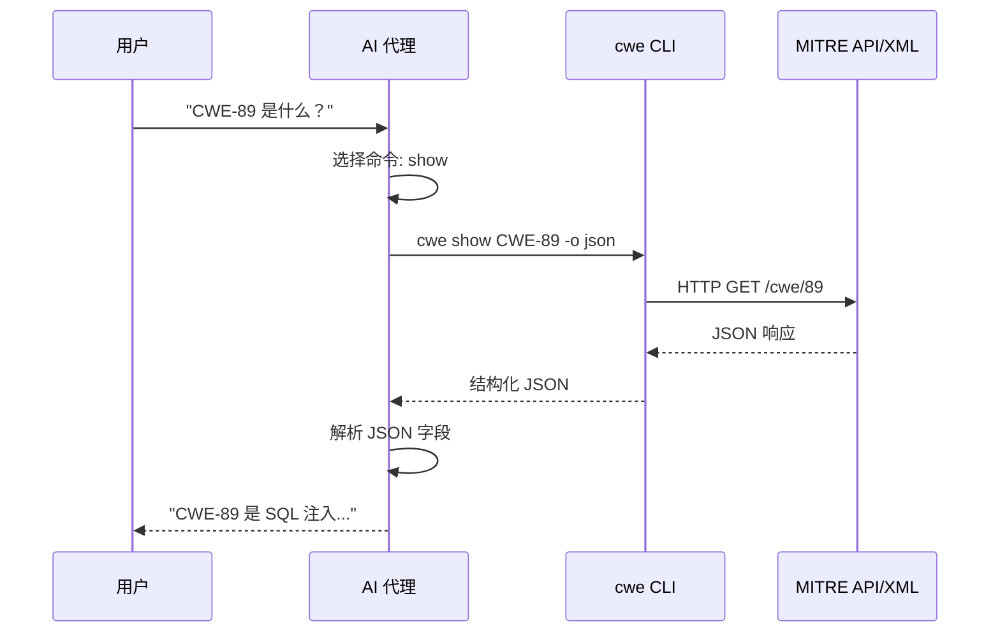

# 🦾 Skills 接入（AI 代理）

**Skills** 是 CWE Skills 最独特的接入方式：**零代码**，把一段提示词放进 AI 代理的系统提示词或技能配置，AI 就能自主调用 `cwe` CLI 完成全部 CWE 操作。

::: tip 为什么 Skills 最省事
AI 擅长「调用工具」和「推理」，不擅长「处理 HTTP 边角、记速率限制、解析半结构化文本」。Skills 把这些脏活儿交给 `cwe` CLI，AI 只管「决定调用哪个命令、解读 JSON 结果、给出结论」。
:::

---

## 📋 前置条件

1. **AI 代理**：Claude、GPT 等支持调用外部命令或具备工具执行能力的代理。
2. **`cwe` CLI**：已安装在 AI 代理可执行的环境里。安装见 [安装](./installation)。

```bash
# 验证 CLI 可用
cwe version
```

3. **（可选）离线 XML**：若要让 AI 做导航/建树/搜索，需在环境里放一份 `cwec_v4.15.xml`，见 [离线 XML](./online-offline)。

---

## 📝 接入步骤

### 1. 复制 Skills 提示词

把下面这段 Markdown 复制到 AI 代理的系统提示词、或技能配置文件中：

```markdown
## CWE Skills

你可以使用 `cwe` CLI工具进行CWE（通用缺陷枚举）操作。

### 安装
```bash
curl -sL https://github.com/scagogogo/cwe-skills/releases/latest/download/cwe-skills_latest_linux_x86_64.tar.gz | tar xz && sudo mv cwe /usr/local/bin/
```

### 核心命令
| 命令 | 功能 |
|------|------|
| `cwe parse CWE-79` | 解析CWE ID |
| `cwe validate CWE-79` | 验证CWE ID格式 |
| `cwe show CWE-79` | 从MITRE API获取弱点详情 |
| `cwe wellknown check CWE-79` | 检查是否在Top 25/OWASP/SANS列表 |
| `cwe enum abstraction` | 列出枚举值 |
| `cwe search --xml <file> --keyword Injection` | 搜索离线XML目录 |
| `cwe filter --xml <file> --abstraction Base --status Stable` | 多条件过滤 |
| `cwe registry get CWE-79 --xml <file>` | 从本地注册表获取条目 |
| `cwe nav ancestors CWE-79 --xml <file>` | 离线导航关系 |
| `cwe nav shortest-path CWE-79 CWE-1 --xml <file>` | 查找两个CWE间最短路径 |
| `cwe tree build CWE-1 --xml <file>` | 构建层次树 |
| `cwe stats --xml <file>` | XML目录统计 |

### 输出格式
所有命令支持 `-o json` 输出结构化JSON。示例: `cwe parse CWE-79 -o json`
```

::: details 完整版提示词
仓库根目录的 `README.zh.md` 里有更完整的 Skills 提示词（含 Go SDK 摘要与技能文档链接）。需要更丰富的 AI 能力时可一并粘贴。渐进式技能文档见 `docs/skills/` 目录。
:::

### 2. 让 AI 用起来

配置好后，直接用自然语言向 AI 提问即可。AI 会自主选择并调用合适的 `cwe` 命令。

---

## 💬 使用示例

### AI 调用流程



### 示例 1：基础查询

```text
你: CWE-89 是什么？在不在 Top 25？

AI: （调用 cwe show CWE-89、cwe wellknown check CWE-89）
    CWE-89 是 SQL 注入（Improper Neutralization of Special Elements
    used in an SQL Command）。它在 CWE Top 25 中排名靠前，同时也属于
    OWASP Top 10 的 A03:2021-Injection 类别。
```

### 示例 2：从文本提取

```text
你: 这段描述里提到了哪些 CWE？"该模块存在 XSS 和 SQL 注入问题，参见 CWE-79 和 CWE-89"

AI: （调用 cwe extract "..."）
    提取到：CWE-79（跨站脚本）、CWE-89（SQL 注入）。
```

### 示例 3：离线关系分析

```text
你: 给我看 CWE-79 到 CWE-1 的祖先链和最短路径，用本地的 cwec_v4.15.xml

AI: （调用 cwe nav ancestors CWE-79 --xml cwec_v4.15.xml、
     cwe nav shortest-path CWE-79 CWE-1 --xml cwec_v4.15.xml）
    CWE-79 的祖先链为：CWE-79 → CWE-74（注入）→ CWE-707 → ...
    到 CWE-1 的最短路径为：[79, 74, 707, ..., 1]，共 N 跳。
```

### 示例 4：批量过滤

```text
你: 帮我找出所有「Base 级别 + Stable 状态 + 高利用可能性」的注入类弱点

AI: （调用 cwe search --xml cwec_v4.15.xml --keyword Injection，
     再 cwe filter --abstraction Base --status Stable --likelihood High）
    找到 N 条匹配：CWE-79 XSS、CWE-89 SQL注入、...
```

---

## 🤖 让 AI 用 JSON 输出更稳

AI 解析 CLI 的 text 输出可能有歧义，**建议让 AI 加 `-o json`**，结果结构化、解析无歧义：

```text
你: 查 CWE-79 的详情，用 JSON 格式拿结果再总结给我。

AI: （调用 cwe show CWE-79 -o json，解析 JSON 字段）
    名称：Cross-site Scripting (XSS)
    抽象层级：Base
    状态：Stable
    常见后果：机密性/完整性 High
    ...
```

::: tip 提示 AI 用 -o json
在系统提示词里已写明「所有命令支持 `-o json`」。如果 AI 忘了加，你可以追加一句「请用 -o json 重新调用」。
:::

---

## 🧠 渐进式技能文档

仓库 `docs/skills/` 下有 12 篇渐进式技能文档，从简到深，可作为 AI 的能力参考（也可直接喂给 AI）：

| # | 技能 | 描述 |
|---|------|------|
| 1 | CWE ID 解析与验证 | 解析、验证、格式化 |
| 2 | CWE ID 提取与比较 | 从文本提取、比较 |
| 3 | 知名列表 | Top 25 / OWASP / SANS |
| 4 | 枚举类型 | 抽象、状态、关系 |
| 5 | API 获取弱点详情 | 在线获取 |
| 6 | API 关系查询 | 在线关系 |
| 7 | API 版本检查 | MITRE API 版本 |
| 8 | 本地搜索与过滤 | 多条件过滤 |
| 9 | 本地注册表操作 | 加载、查询、导出 |
| 10 | 本地关系导航 | 离线导航 |
| 11 | 本地树构建 | 层次树 |
| 12 | SDK 序列化 | JSON/XML/CSV |

::: info 喂给 AI 增强能力
把 `docs/skills/README.md` 或其中几篇粘进 AI 上下文，能让 AI 更精确地知道「什么场景该用哪个命令」。文档越全，AI 调用越准。
:::

---

## ⚠️ 注意事项

::: warning CLI 必须装在 AI 能跑的环境
Skills 依赖 AI 执行 `cwe` 命令。若 AI 运行在沙箱/无 CLI 环境，Skills 不可用——此时改用 [Go SDK](./integration-sdk) 或等待 [MCP](./integration-mcp)。
:::

::: info 在线命令受速率限制
AI 连续调用在线命令（`cwe show`、`cwe relations`）时，可能触发 MITRE 速率限制，CLI 会自动等待。若 AI 表现「卡顿」，可能是限流，不是出错。见 [速率限制](./rate-limit-retry)。
:::

::: tip 离线命令更快更全
导航、建树、搜索等离线命令（带 `--xml`）不受速率限制，且关系类型完整。鼓励 AI 优先用离线命令做关系分析。
:::

---

## 📖 相关文档

- [四种接入方式总览](./integrations)
- [CLI 接入](./integration-cli)（Skills 的后端）
- [CLI 命令参考](../cli/overview)
- [输出格式](./output-format)
- [在线 vs 离线](./online-offline)
