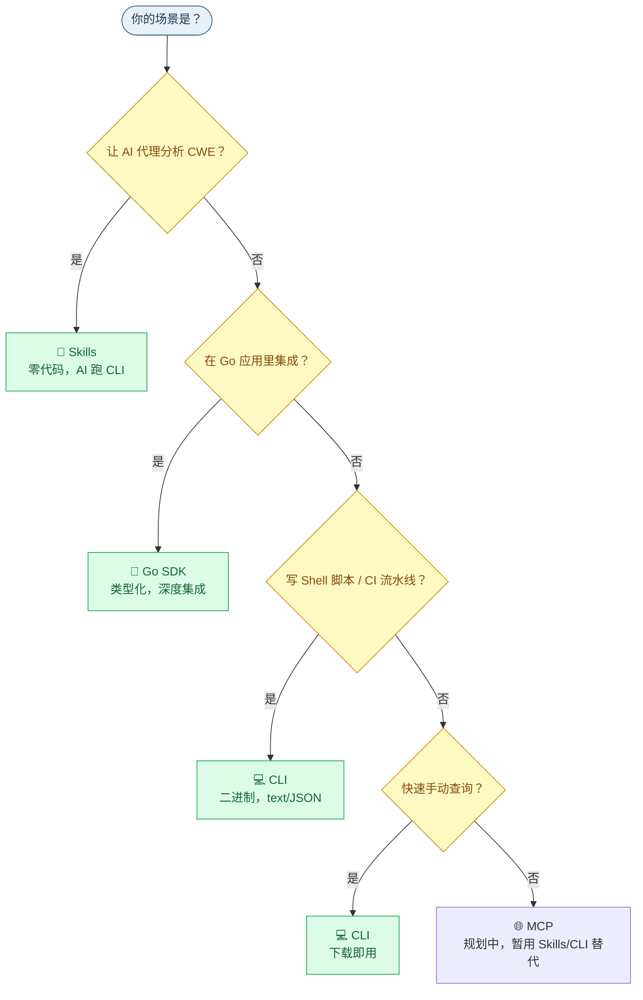

# 🔌 四种接入方式总览

CWE Skills 提供 **四种** 接入方式，覆盖人类开发者、Go 应用、Shell 脚本、AI 代理的全部场景。四种方式背后是同一套能力，只是入口不同——选对方式，能省下大量集成工作。

---

## 📊 对比总表

| 维度 | Skills | Go SDK | CLI | MCP |
|------|--------|--------|-----|-----|
| **谁在用** | AI 代理（Claude/GPT） | Go 应用与库 | Shell/CI/开发者 | MCP 兼容 AI 工具 |
| **形态** | 提示词 | Go 包 | 二进制可执行文件 | MCP 服务器 |
| **安装** | 复制提示词 | `go get` | 下载二进制 | `go build ./cmd/cwe-mcp` |
| **代码量** | 零代码 | 写 Go | 写 Shell | 零代码 |
| **输出** | AI 调用 CLI（JSON） | Go 对象 | text / JSON | MCP 工具调用 |
| **在线能力** | ✅（CLI 调 API） | ✅ | ✅ | ✅ |
| **离线能力** | ✅（CLI 调 XML） | ✅ | ✅ | ✅ |
| **状态** | <Badge type="tip" text="可用" /> | <Badge type="tip" text="可用" /> | <Badge type="tip" text="可用" /> | <Badge type="tip" text="可用" /> |

::: tip 四种方式能力对等
Skills / SDK / CLI / MCP 背后是同一套 `cweskills` 包能力，**功能上没有高低之分**，区别只在「谁来调用、怎么调用」。选哪个取决于你的集成场景。
:::

---

## 🦾 1. Skills — AI 代理接入

把一段提示词放进 AI 代理（Claude、GPT 等）的系统提示词或技能配置，AI 即可自主调用 `cwe` CLI 完成解析、查询、导航、建树等全部操作。

**最适合**：让 AI 做安全分析、CWE 调研、漏洞分类、生成修复建议。

```text
你: 帮我查 CWE-79 的祖先链和缓解措施。
AI: （自主调用 cwe nav ancestors / cwe show，输出 JSON）
    CWE-79 的祖先是 CWE-74（注入）→ CWE-707 ...，缓解措施是输出编码...
```

- 安装：复制 [Skills 提示词](./integration-skills) 到 AI 配置
- 前提：AI 所在环境已装好 `cwe` CLI
- 零代码，AI 直接跑命令

详见 [Skills 接入](./integration-skills)。

---

## 🔧 2. Go SDK — 嵌入应用

把 `cweskills` 包 import 进你的 Go 应用，以原生 Go 类型（`*CWE`、`*Registry`、`*Navigator`…）调用全部能力。

**最适合**：SAST/DAST 工具、漏洞管理平台、合规检查系统等需要深度集成的 Go 项目。

```go
import "github.com/scagogogo/cwe-skills"

id, _ := cweskills.ParseCWEID("CWE-79")
cweskills.IsInTop25(79) // true
client := cweskills.NewAPIClient()
weakness, _ := client.GetWeakness(ctx, 79)
```

- 安装：`go get github.com/scagogogo/cwe-skills`
- 类型化、编译期检查、结构化错误
- 零依赖核心（仅标准库）

详见 [Go SDK 接入](./integration-sdk)。

---

## 💻 3. CLI — 命令行与脚本

下载预编译二进制，在 Shell / CI 流水线里直接调用 `cwe` 子命令。40+ 子命令覆盖全部能力，所有命令支持 `-o text|json`。

**最适合**：Shell 脚本、CI/CD 流水线、快速查询、给 Skills 当后端。

```bash
cwe parse CWE-79
cwe wellknown check CWE-79
cwe show CWE-79
cwe nav ancestors CWE-79 --xml cwec_v4.15.xml
cwe tree build CWE-1 --xml cwec_v4.15.xml
cwe parse CWE-79 -o json   # 脚本友好
```

- 安装：[Releases](https://github.com/scagogogo/cwe-skills/releases/latest) 下载 / Homebrew / Scoop / go install
- 30+ 平台预编译
- text/JSON 双格式输出

详见 [CLI 接入](./integration-cli) 与 [CLI 命令](../cli/overview)。

---

## 🌐 4. MCP — AI 工具协议接入

MCP（Model Context Protocol）是 AI 工具调用的标准化协议。CWE Skills 提供官方 MCP 服务器 `cwe-mcp`，暴露 15 个工具，让任何 MCP 兼容的 AI 工具能以「工具调用」方式访问 CWE 能力，无需 AI 自己跑 Shell 命令。

**最适合**：MCP 兼容的 AI 工具生态（Claude Desktop、Cursor 等），需要标准化工具调用而非裸 CLI 的场景，沙箱/受限环境。

- 状态：<Badge type="tip" text="可用" /> <Badge type="info" text="15 个工具" />
- 安装与工具清单见 [MCP 接入](./integration-mcp)

---

## 🧭 怎么选？



::: tip 组合使用很常见
实际项目里常**组合**多种方式：Go 应用用 SDK 做核心集成，运维脚本用 CLI 做自动化，安全分析师让 AI 用 Skills 做调研。三者数据互通（同一个 `cweskills` 包，同一份 XML）。
:::

---

## ⚡ 能力矩阵（四种方式都能做这些）

无论选哪种方式，以下能力都可用：

| 能力 | 说明 |
|------|------|
| 🆔 ID 工具 | 解析/格式化/验证/提取/比较 |
| 📚 枚举 | 抽象/结构/状态/关系/后果/视图类型 |
| 🏆 知名列表 | Top 25 / OWASP / SANS 查询 |
| 🌐 在线 API | 获取弱点/类别/视图/关系/版本 |
| 📥 离线 XML | 解析、注册表、索引 |
| 🧭 关系导航 | 父子/祖先/对等/链/复合/最短路径 |
| 🌳 树构建 | BuildTree/Forest/ViewTree + 遍历 |
| 🔍 搜索过滤 | 多条件、排序、分组、去重 |
| 📦 序列化 | JSON/XML/CSV 导入导出 |

差别只在于「调用语法」：SDK 是 Go 函数，CLI 是子命令，Skills 是 AI 跑 CLI，MCP 是工具调用。

---

## 📖 下一步

按你选的方式深入：

- [Skills 接入](./integration-skills)
- [Go SDK 接入](./integration-sdk)
- [CLI 接入](./integration-cli)
- [MCP 接入（规划中）](./integration-mcp)
