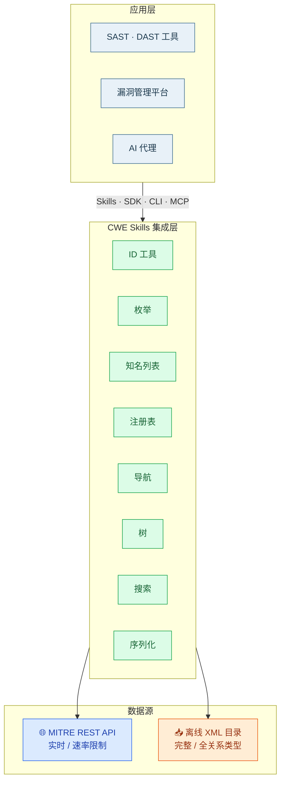

# 🚀 CWE Skills 是什么？

CWE Skills 是一个 **AI 原生的 CWE（通用缺陷枚举）集成层**，用 Go 语言编写。它把 MITRE CWE 生态里散落的几样东西——REST API、XML 弱点目录、权威知名列表——整合成一个统一的、可被人类和 AI 代理同时调用的能力层。

简而言之：**你不用再自己写 CWE ID 解析器、不用再手工调 MITRE API、不用再维护一份 Top 25 列表。** 这些活儿 CWE Skills 都帮你干了。

::: tip 一句话定位
CWE Skills 不是一个安全扫描器，而是一个 **CWE 数据与知识的集成层**——它负责把 CWE 用对、用全、用得快，让上层的 SAST/DAST 工具、漏洞管理平台、AI 代理可以专注业务逻辑。
:::

---

## 🧭 整体定位

CWE（Common Weakness Enumeration）是 MITRE 组织维护的「通用缺陷枚举」，它给每一类软件安全弱点分配一个编号（如 `CWE-79` 跨站脚本），并维护庞大的层级关系、后果描述、缓解措施。但 MITRE 提供的「原料」并不好用：

- REST API 实时但有速率限制，且只返回部分关系类型；
- XML 目录完整但文件巨大、解析繁琐；
- 各类「Top 25」「OWASP Top 10」列表散落在不同文档里，格式不一；
- 不同系统、不同团队各自手写一套解析逻辑，重复造轮子。

CWE Skills 的定位就是**填平这一层**：向下对接 MITRE 的 API 与 XML，向上以四种方式把统一、类型化、可检索的 CWE 能力暴露给你的应用和 AI 工作流。



---

## 🦾 四种接入方式概览

CWE Skills 提供 **四种** 接入方式，覆盖从「一行命令」到「嵌入 Go 应用」再到「AI 代理直接调用」的全部场景：

| # | 方式 | 谁适合用 | 一行安装 / 接入 | 状态 |
|---|------|---------|----------------|------|
| 1 | **Skills** | AI 代理（Claude、GPT 等） | 复制提示词到系统提示词 | <Badge type="tip" text="可用" /> |
| 2 | **Go SDK** | Go 应用与库 | `go get github.com/scagogogo/cwe-skills` | <Badge type="tip" text="可用" /> |
| 3 | **CLI** | Shell 脚本与开发工作流 | 从 [Releases](https://github.com/scagogogo/cwe-skills/releases/latest) 下载二进制 | <Badge type="tip" text="可用" /> |
| 4 | **MCP** | MCP 兼容的 AI 工具 | — | <Badge type="warning" text="规划中" /> |

::: details 四种方式各自的「最小例子」
```bash
# 1) Skills —— 把提示词给 AI，AI 自己跑 cwe CLI
#    （详见 integration-skills）

# 2) Go SDK
go get github.com/scagogogo/cwe-skills
```
```go
import "github.com/scagogogo/cwe-skills"
id, _ := cweskills.ParseCWEID("CWE-79")
cweskills.IsInTop25(79) // true
```
```bash
# 3) CLI
cwe parse CWE-79
cwe wellknown check CWE-79

# 4) MCP —— 即将推出
```
:::

详细的对比与选型见 [四种接入方式总览](./integrations)。

---

## ⚙️ 核心能力一览

CWE Skills 把能力组织成几个相互协作的模块：

- 🆔 **CWE ID 工具** —— 解析 / 格式化 / 验证 / 从文本提取 / 比较，兼容 `CWE-79`、`cwe 79`、`79` 等多种写法
- 📚 **类型化枚举** —— 抽象层级、结构、状态、利用可能性、关系类型、后果范围/影响、视图类型、平台类型，全部带 `IsValid()` / `ParseXxx()` / `AllXxxValues()`
- 🏆 **知名列表** —— 内置 CWE Top 25 (2024)、OWASP Top 10 (2021)、SANS Top 25，以及 CWE-1000/699/1199/888/1400 等知名视图常量
- 🌐 **MITRE REST API 客户端** —— 默认 `https://cwe-api.mitre.org/api/v1`，内置令牌桶速率限制、自动重试、结构化错误
- 📥 **离线 XML 目录解析器** —— 解析 MITRE 官方 XML，构建内存 `Registry` 与多层索引
- 🧭 **关系导航** —— 父/子/祖先/后代/同级/对等/前置/跟随/依赖/被依赖/链成员/组合成员/最短路径/关系深度，**比在线 API 更完整**
- 🌳 **树构建** —— `BuildTree` / `BuildForest` / `BuildViewTree`，DFS/BFS 遍历、路径、叶子、深度
- 🔍 **搜索与过滤** —— 关键字 / 抽象 / 状态 / 可能性 / 后果范围 / 结构；排序 / 分组 / 去重
- 📦 **序列化** —— JSON / XML / CSV，含 `safeCWE` 安全序列化模型
- 💻 **40+ CLI 子命令** —— 基于 cobra，全部支持 `-o text|json`

::: info 在线 vs 离线，两条路都通
CWE Skills 同时支持「在线调 MITRE API」和「离线解析 XML 目录」两条数据路径。在线实时但受速率限制、关系类型不全；离线完整（含全部 10 种关系类型）但需要先下载 XML 文件。详见 [在线 vs 离线模式](./online-offline)。
:::

---

## ⚡ 设计原则

1. **零依赖核心** —— 核心 SDK 仅使用 Go 标准库，无任何第三方包；CLI 仅依赖 `cobra`。编译产物小、审计友好、可静态链接。见 [性能与零依赖](./performance)。
2. **类型化优先** —— 所有 CWE 概念（抽象层级、关系类型……）都是带方法的枚举类型，而非裸字符串，编译期就能挡住拼写错误。
3. **结构化错误** —— 统一的 `CWEError` 体系，支持 `errors.Is` / `errors.As`，方便上层做错误分类。见 [错误处理](./error-handling)。
4. **人类与 AI 并重** —— CLI 同时输出人类可读的 `text` 与机器可读的 `json`，AI 代理和 CI 脚本都能直接消费。见 [输出格式](./output-format)。

---

## 📌 版本与许可

- 模块路径：`github.com/scagogogo/cwe-skills`
- 包名：`cweskills`
- 版本常量：`Version = "v0.0.1"`
- 许可证：MIT

```go
import "github.com/scagogogo/cwe-skills"
fmt.Println(cweskills.Version) // v0.0.1
```

---

## 📖 接下来读什么

- 想知道为什么需要它 → [为什么需要 CWE Skills](./why)
- 想看痛点→方案对照 → [解决了什么问题](./problem-solved)
- 想了解内部如何运转 → [工作原理](./how-it-works)
- 想马上跑起来 → [快速开始](./quick-start)
- 想安装到本机 → [安装](./installation)
