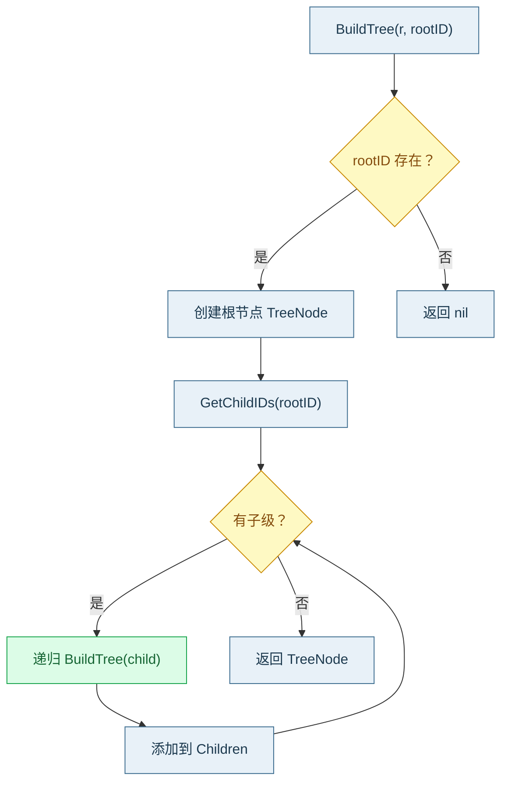

# 🌳 构建单棵树

`BuildTree` 以指定弱点为根，从 `Registry` 的子级索引向下递归，构造一棵完整的子树。适合「以某个 Pillar/Class 为根展开其全部后代」的场景。

## 📐 函数签名

```go
func BuildTree(r *Registry, rootID int) *TreeNode
```

| 参数 | 类型 | 说明 |
| --- | --- | --- |
| `r` | `*Registry` | 已构建索引的注册表 |
| `rootID` | `int` | 根弱点 ID |
| 返回 | `*TreeNode` | 根节点；`rootID` 不存在时返回 `nil` |

## 🔄 构建流程



::: warning 前置索引
`BuildTree` 内部调用 `GetChildIDs`。若未 `BuildIndexes()`，树将只有根节点、无子树。
:::

## ✅ 示例

```go
package main

import (
	"fmt"
	"github.com/scagogogo/cwe-skills"
)

func main() {
	r := cweskills.NewRegistry()
	r.Register(cweskills.NewCWE(703, "Neutralization"))
	link := func(child, parent int, name string) {
		c := cweskills.NewCWE(child, name)
		c.Relationships = []cweskills.Relationship{
			{CWEID: parent, Nature: cweskills.RelationshipChildOf},
		}
		r.Register(c)
	}
	link(79, 703, "XSS")
	link(89, 703, "SQLi")
	link(791, 79, "Variant")
	r.BuildIndexes()

	root := cweskills.BuildTree(r, 703)
	fmt.Println(root.CWE.Name)   // Neutralization
	fmt.Println(root.Count())    // 4
	fmt.Println(root.MaxDepth()) // 2
}
```

## ⚠️ 注意事项

::: danger 环路保护
若数据存在环路（A ChildOf B 且 B ChildOf A），递归构建会无限循环。SDK 内部用访问集合去重，环路节点只挂载一次，避免死循环。
:::

::: details 仅向下展开
`BuildTree` 只沿子级（`ParentOf`）方向向下展开，不向上回溯父级。因此根节点的 `Parent` 恒为 `nil`，即使该弱点在注册表中有父级。
:::

## 🔗 相关链接

- 节点类型：[TreeNode 节点](./tree-node)
- 全库森林：[构建森林](./build-forest)
- 视图投影：[构建视图树](./build-view-tree)
- 遍历结果：[树遍历](./tree-walk)
- 源文件：[`tree.go`](https://github.com/scagogogo/cwe-skills/blob/main/tree.go)
