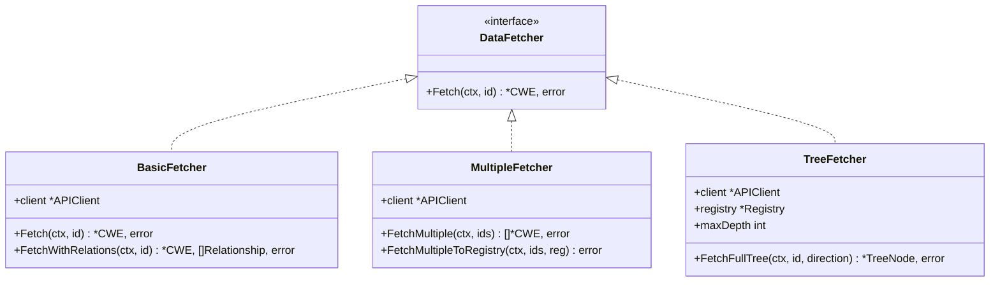

# 🌐 DataFetcher — 数据获取接口与实现

`DataFetcher` 是 `cweskills` 包对「CWE 数据来源」的抽象。它把获取方式（在线 API、本地注册表、批量、递归树）封装在不同实现里，上层只面向 `Fetch(ctx, id)` 这一个接口。这是策略模式的典型应用。

源文件：`data_fetcher.go`。

## 📐 接口定义

```go
type DataFetcher interface {
    Fetch(ctx context.Context, id int) (*CWE, error)
}
```

| 参数 | 类型 | 说明 |
| --- | --- | --- |
| `ctx` | `context.Context` | 请求上下文 |
| `id` | `int` | CWE ID |

返回 `(*CWE, error)`。接口只要求单条获取，各实现在此基础上扩展额外方法。

## 🧩 实现矩阵



| 实现 | 构造函数 | 特长 | 文档 |
| --- | --- | --- | --- |
| `BasicFetcher` | `NewBasicFetcher(client)` | 单条 + 关系获取 | [BasicFetcher](./basic-fetcher) |
| `MultipleFetcher` | `NewMultipleFetcher(client)` | 批量获取、灌入 Registry | [MultipleFetcher](./multiple-fetcher) |
| `TreeFetcher` | `NewTreeFetcher(client, registry, maxDepth)` | 递归祖先/后代树 | [TreeFetcher](./tree-fetcher) |

三者都内嵌一个 `*APIClient`。构造函数对 `nil` client 会自动 `NewAPIClient()`，因此最低使用成本是零配置。

## 🔄 选型决策

| 场景 | 推荐 |
| --- | --- |
| 拿一两条弱点的完整详情 | `BasicFetcher.Fetch` |
| 一次性拿几十条做批量分析 | `MultipleFetcher.FetchMultiple` |
| 构建离线缓存到 Registry | `MultipleFetcher.FetchMultipleToRegistry` |
| 画弱点血缘树、需控制深度 | `TreeFetcher.FetchFullTree` |
| 拿弱点 + 直接父子关系 | `BasicFetcher.FetchWithRelations` |

::: tip 与 XMLParser 的互补
[`XMLParser`](./xml-parser) 一次性把全量 XML 灌入 `Registry`，适合离线；`DataFetcher` 系列按需从 API 拉取，适合在线与增量。二者可共用同一个 `Registry`——XML 预加载热点，缺失的再用 `MultipleFetcher` 补齐。
:::

## 🚀 可运行示例

```go
package main

import (
    "context"
    "fmt"
    "log"

    "github.com/scagogogo/cwe-skills"
)

func main() {
    client := cweskills.NewAPIClient()
    defer client.Close()

    var fetcher cweskills.DataFetcher = cweskills.NewBasicFetcher(client)
    w, err := fetcher.Fetch(context.Background(), 79)
    if err != nil {
        log.Fatal(err)
    }
    fmt.Println("通过接口获取:", w.Name)
}
```

::: warning 接口只暴露 Fetch
`DataFetcher` 接口仅含 `Fetch`。要调用 `FetchMultiple`、`FetchWithAncestors` 等扩展方法，需用具体类型（`*MultipleFetcher`、`*TreeFetcher`）而非接口变量。
:::

## 📚 相关链接

- [BasicFetcher](./basic-fetcher) | [MultipleFetcher](./multiple-fetcher) | [TreeFetcher](./tree-fetcher) | [APIClient](./api-client) | [XMLParser](./xml-parser)
