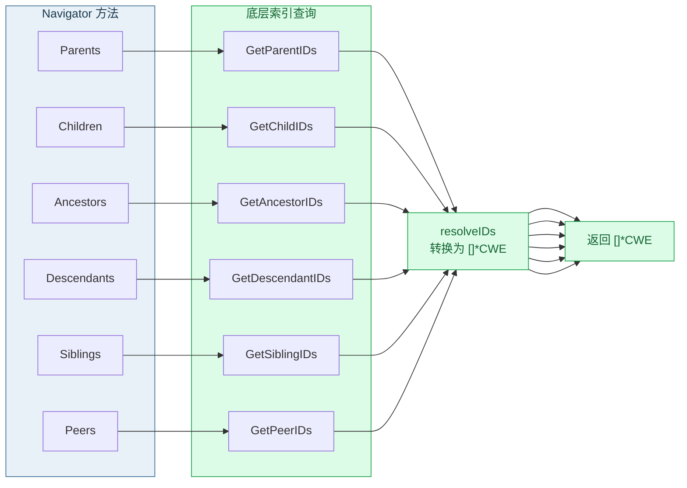

# 🧭 关系导航概览

`Navigator` 是基于 `Registry` 索引的**图遍历引擎**。它把 CWE 之间的关系网络抽象为一组返回 `[]*CWE` 的查询方法，覆盖父子、祖孙、对等、链式、复合成员等全部 MITRE 关系语义，并提供路径查找与关系判定。

## 🏗️ 构造器

```go
func NewNavigator(r *Registry) *Navigator
```

| 参数 | 类型 | 说明 |
| --- | --- | --- |
| `r` | `*Registry` | 已加载并构建索引的注册表 |

::: warning 依赖已构建的索引
`NewNavigator` 不自动调用 `BuildIndexes()`。构造前请确保 `r.IndexesBuilt()` 为 `true`，否则导航方法返回空结果。
:::

## 📚 方法总览

| 类别 | 方法 | 文档 |
| --- | --- | --- |
| 父子 | `Parents` / `Children` | [父子导航](./nav-parents-children) |
| 祖孙 | `Ancestors` / `Descendants` | [祖先与后代](./nav-ancestors-descendants) |
| 对等 | `Siblings` / `Peers` | [兄弟与对等](./nav-siblings-peers) |
| 链式 | `CanPrecede` / `CanFollow` | [前置与后继](./nav-precede-follow) |
| 依赖 | `Requires` / `RequiredBy` | [依赖关系](./nav-requires) |
| 替代 | `CanAlsoBe` | [可作为](./nav-can-also-be) |
| 复合 | `ChainMembers` / `CompositeMembers` | [链与复合成员](./nav-chain-composite) |
| 路径 | `ShortestPath` | [最短路径](./nav-shortest-path) |
| 判定 | `IsAncestorOf` / `IsDescendantOf` / `IsRelated` | [祖先与关联判定](./nav-ancestor-related) |
| 深度 | `RelationshipDepth` | [关系深度](./nav-relationship-depth) |

## 🗺️ 方法分组与数据流



所有导航方法返回 `[]*CWE`；路径/判定方法返回 `[]int` / `bool` / `int`。

## ✅ 快速上手

```go
package main

import (
	"fmt"
	cweskills "github.com/scagogogo/cwe-skills"
)

func main() {
	r := cweskills.NewRegistry()
	r.Register(cweskills.NewCWE(703, "Neutralization"))
	b := cweskills.NewCWE(79, "XSS")
	b.Relationships = []cweskills.Relationship{
		{CWEID: 703, Nature: cweskills.RelationshipChildOf},
	}
	r.Register(b)
	r.BuildIndexes()

	nav := cweskills.NewNavigator(r)
	for _, p := range nav.Parents(79) {
		fmt.Println("父级:", p.Name) // 父级: Neutralization
	}
	fmt.Println(nav) // Navigator 的字符串表示
}
```

## 🆚 与 Registry 索引查询的区别

| 维度 | [Registry 索引查询](./relationship-indexes) | Navigator |
| --- | --- | --- |
| 返回 | `[]int`（ID） | `[]*CWE`（指针） |
| 路径算法 | 无 | `ShortestPath`（BFS） |
| 关系判定 | 无 | `IsAncestorOf` 等 |
| 适用 | 仅需 ID | 需条目本体或图算法 |

## 🔗 相关链接

- 依赖的索引：[构建索引](./build-indexes)
- 索引查询（返回 ID）：[关系索引查询](./relationship-indexes)
- 源文件：[`navigator.go`](https://github.com/scagogogo/cwe-skills/blob/main/navigator.go)
