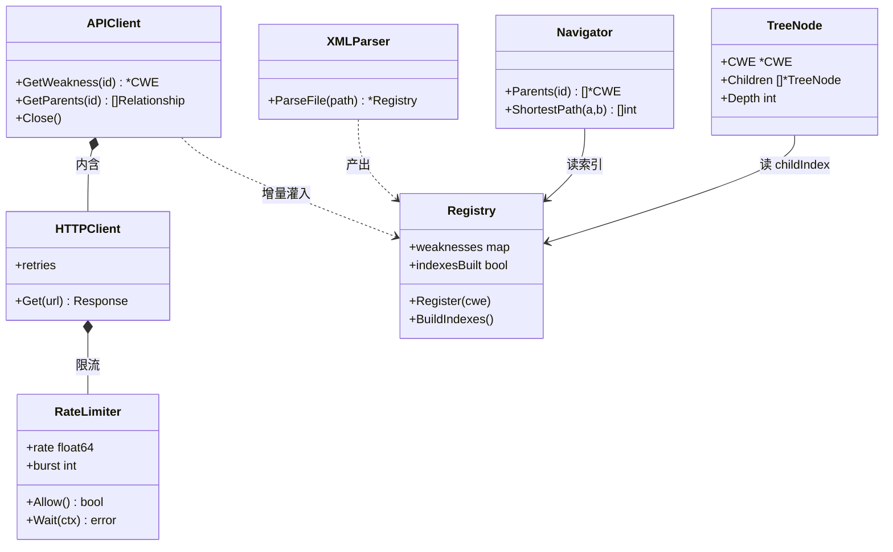
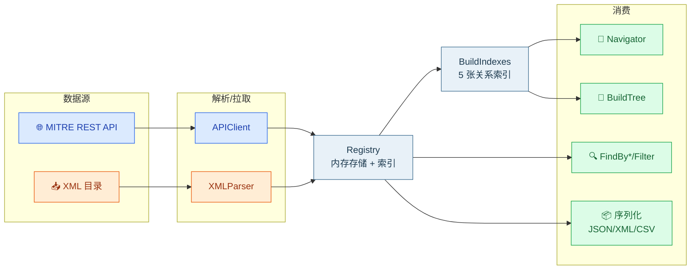

# 🔧 SDK API 参考

<Badge type="tip" text="Go SDK" /> <Badge type="info" text="包 cweskills" /> <Badge type="info" text="模块 github.com/scagogogo/cwe-skills" /> <Badge type="warning" text="v0.0.1" />

`cweskills` 是 CWE Skills 的核心 Go SDK，提供对 CWE（通用缺陷枚举）的完整编程访问能力。本文档站这一部分是 SDK 的逐模块、逐函数 API 参考。

::: tip 一句话定位
把 MITRE CWE 的 ID 规范、数据模型、在线 API、离线 XML 目录、关系图谱、层次树、搜索过滤与序列化，统一封装成一个零依赖的 Go 包。
:::

## 📦 安装

```bash
go get github.com/scagogogo/cwe-skills
```

```go
import cweskills "github.com/scagogogo/cwe-skills"
```

::: warning 包名与模块名
模块路径是 `github.com/scagogogo/cwe-skills`，但 Go 包名是 `cweskills`（与目录名一致）。导入时建议显式起别名 `cweskills` 以避免混淆。
:::

## 🗺️ 模块地图

SDK 由以下源文件组成，每个文件/函数都有对应的文档页：

| 模块 | 源文件 | 职责 | 文档 |
|------|--------|------|------|
| 🆔 CWE ID 工具 | `cwe_utils.go` | 解析、格式化、验证、提取、比较 CWE ID | [CWE ID 工具](./cwe-utils) |
| 🧱 数据模型 | `model.go` | CWE/Category/View/CompoundElement 等结构体 | [数据模型](./model) |
| 📚 枚举类型 | `enums.go` | Abstraction/Status/RelationshipNature 等 10 类枚举 | [枚举概览](./enums) |
| 🏆 知名列表 | `wellknown_ids.go` | Top 25 / OWASP / SANS / 知名视图 | [知名列表概览](./wellknown-ids) |
| 🗃️ 注册表 | `registry.go` | 内存存储 + 多层索引 | [注册表](./registry) |
| 🧭 关系导航 | `navigator.go` | 父/子/祖先/后代/最短路径等 | [导航器](./navigator) |
| 🌳 树构建 | `tree.go` | BuildTree/Forest/ViewTree + 遍历 | [树](./tree) |
| 🔍 搜索 | `search.go` | 按关键字/抽象/状态等查找 | [搜索](./search) |
| 🧹 过滤 | `filter.go` | 多条件过滤/排序/分组/去重 | [过滤](./filter) |
| 📊 统计 | `stats.go` | 各维度计数 | [统计](./stats) |
| 📦 序列化 | `serializer.go` | JSON/XML/CSV 导入导出 | [序列化](./serializer) |
| 🌐 API 客户端 | `api_client*.go` | MITRE REST API | [API 客户端](./api-client) |
| 🚦 HTTP/限流 | `http_client.go` `http_rate_limiter.go` | 速率限制、重试 | [HTTP 客户端](./http-client) |
| 📥 XML 解析 | `xml_parser.go` | 离线 XML 目录解析 | [XML 解析](./xml-parser) |
| 📥 数据获取 | `data_fetcher.go` | Basic/Multiple/Tree Fetcher | [数据获取](./data-fetcher) |
| ⚠️ 错误 | `errors.go` | 结构化错误体系 | [错误处理](./errors) |
| 📦 包信息 | `cwe.go` | `Version` 常量 | [包与版本](./package) |

### 📊 核心类结构图

SDK 各核心类型的关系与组合方式：



### 🗺️ 数据流模块地图

从数据源到输出的完整链路：



## 🚀 5 分钟上手

```go
package main

import (
    "context"
    "fmt"
    cweskills "github.com/scagogogo/cwe-skills"
)

func main() {
    // 1. CWE ID 工具
    id, _ := cweskills.ParseCWEID("CWE-79")
    fmt.Println(id)                              // 79
    fmt.Println(cweskills.IsInTop25(79))         // true

    // 2. 在线 API
    client := cweskills.NewAPIClient()
    defer client.Close()
    w, _ := client.GetWeakness(context.Background(), 79)
    fmt.Println(w.Name)

    // 3. 离线 XML
    reg, _ := cweskills.NewXMLParser().ParseFile("cwec_v4.15.xml")
    reg.BuildIndexes()
    nav := cweskills.NewNavigator(reg)
    for _, p := range nav.Parents(79) {
        fmt.Println(p.CWEID(), p.Name)
    }
}
```

## 🔗 相关文档

- [指南：快速开始](../guide/quick-start)
- [指南：在线 vs 离线](../guide/online-offline)
- [CLI 命令总览](../cli/overview)
- [包与版本](./package)
