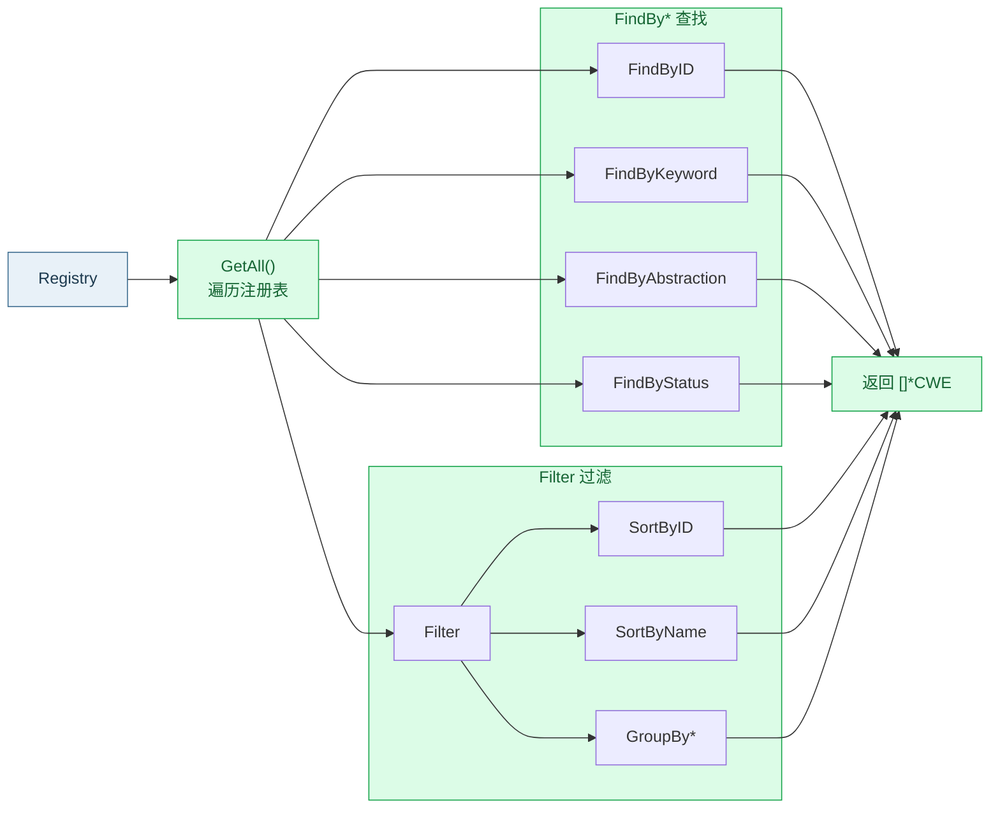

# 🔍 搜索与过滤概览

`cweskills` 提供 `search.go` 与 `filter.go` 两套函数，在 `Registry` 上做查找、过滤、排序、分组与去重。所有函数都是**无状态**的包级函数，输入 `*Registry` 或 `[]*CWE`，输出查询结果。

## 🗺️ search vs filter 分工



## 🔍 search.go — 查找

按不同维度从注册表中检索弱点，返回 `[]*CWE` 或单条 `*CWE`。

| 函数 | 维度 | 文档 |
| --- | --- | --- |
| `FindByID` | 按 ID 精确匹配 | [按 ID 查找](./find-by-id) |
| `FindByKeyword` | 关键词匹配 Name/Description | [按关键词查找](./find-by-keyword) |
| `FindByAbstraction` | 抽象层级 | [按抽象查找](./find-by-abstraction) |
| `FindByStatus` | 状态 | [按状态查找](./find-by-status) |
| `FindByLikelihood` | 被利用可能性 | [按可能性查找](./find-by-likelihood) |
| `FindByConsequenceScope` | 后果范围 | [按后果范围查找](./find-by-consequence-scope) |
| `FindByStructure` | 结构 | [按结构查找](./find-by-structure) |
| `FindTopLevel` | 顶层无父级 | [顶层查找](./find-top-level) |
| `FindBaseWeaknesses` | Base 抽象 | [链与复合/基础](./find-chains-composites) |
| `FindChains` | Chain 结构 | [链与复合/基础](./find-chains-composites) |
| `FindComposites` | Composite 结构 | [链与复合/基础](./find-chains-composites) |

## 🧹 filter.go — 过滤排序分组

| 函数 | 作用 | 文档 |
| --- | --- | --- |
| `Filter` | 多条件 AND 过滤 | [Filter](./filter) |
| `FilterOption` | 过滤选项结构 | [FilterOption](./filter-option) |
| `SortByID` / `SortByName` / `SortByAbstraction` | 排序 | [排序](./sort) |
| `GroupByAbstraction` / `GroupByStatus` / `GroupByLikelihood` | 分组 | [分组](./group-by) |
| `Deduplicate` | 去重 | [去重](./deduplicate) |

## ✅ 快速上手

```go
package main

import (
	"fmt"
	cweskills "github.com/scagogogo/cwe-skills"
)

func main() {
	r := cweskills.NewRegistry()
	c := cweskills.NewCWE(79, "Improper Neutralization XSS")
	c.Abstraction = cweskills.AbstractionBase
	c.Status = cweskills.StatusStable
	c.Description = "Cross-site Scripting"
	r.Register(c)
	r.BuildIndexes()

	// 按关键词
	got := cweskills.FindByKeyword(r, "xss")
	fmt.Println(len(got)) // 1

	// 按抽象
	bases := cweskills.FindByAbstraction(r, cweskills.AbstractionBase)
	fmt.Println(len(bases)) // 1

	// 过滤排序
	sorted := cweskills.SortByID(cweskills.Filter(r.GetAll(),
		cweskills.FilterOption{Status: cweskills.StatusStable}))
	fmt.Println(len(sorted)) // 1
}
```

## ⚠️ 注意事项

::: tip 查找函数不依赖索引
`FindBy*` 系列遍历 `GetAll()`，**不**需要 `BuildIndexes()`。仅 `FindTopLevel` 例外（需判断父级，依赖索引）。
:::

## 🔗 相关链接

- 数据来源：[Registry 基础操作](./registry-operations)
- 统计汇总：[统计概览](./stats)
- 源文件：[`search.go`](https://github.com/scagogogo/cwe-skills/blob/main/search.go)、[`filter.go`](https://github.com/scagogogo/cwe-skills/blob/main/filter.go)
