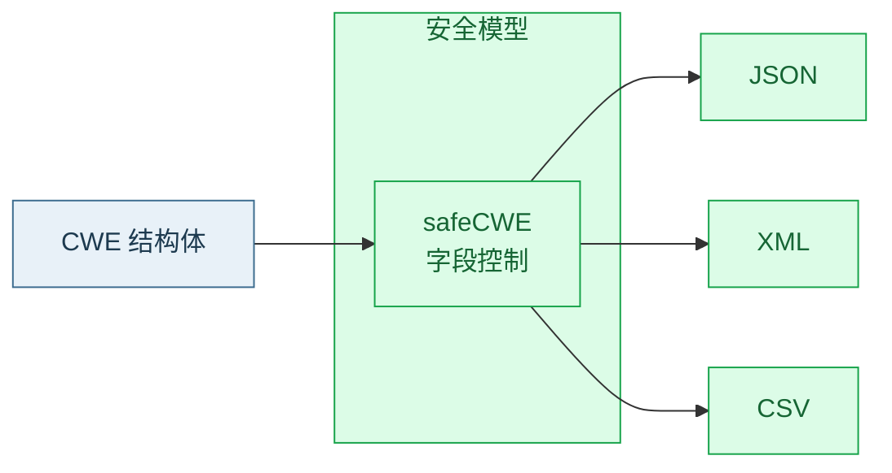

# 📦 序列化概览

`serializer.go` 提供 `CWE` 在 JSON / XML / CSV 三种格式间的序列化与反序列化。整库级别的序列化由 [Registry](./registry) 承担（JSON/CSV），本模块聚焦**单条目与列表**级别。

## 🔄 序列化路径



## 📚 本组文档导航

| 文档 | 主题 | 函数 |
| --- | --- | --- |
| [JSON 序列化](./marshal-json) | 单条目 JSON | `MarshalJSON` / `UnmarshalJSON` |
| [JSON 列表](./marshal-json-list) | 列表 JSON | `MarshalJSONList` / `UnmarshalJSONList` |
| [XML 序列化](./marshal-xml) | 单条目 XML | `MarshalXML` / `UnmarshalXML` |
| [CSV 序列化](./marshal-csv) | 列表 CSV | `MarshalCSV` / `UnmarshalCSV` |
| [注册表导出 CSV](./export-csv) | 整库 CSV | `Registry.ExportCSV` |

## 🧩 内部安全模型

序列化不直接用 `CWE` 结构体的 tag，而是通过内部的 `safeCWE` 安全模型做中转——控制字段命名、可空性、嵌套结构，确保输出稳定且不受 `CWE` 字段调整的直接影响。

::: tip 为什么有 safeCWE？
直接序列化 `CWE` 会让内部字段名（如 `extended_description`）暴露到外部格式。`safeCWE` 提供稳定的对外契约，便于版本演进。
:::

## 📋 CSV 表头

CSV 序列化使用固定表头：

```text
["ID", "Name", "Abstraction", "Structure", "Status", "Description", "LikelihoodOfExploit"]
```

即 CSV 每行 7 列，按此顺序输出。详见 [CSV 序列化](./marshal-csv)。

## ✅ 快速上手

```go
package main

import (
	"fmt"
	"log"
	"github.com/scagogogo/cwe-skills"
)

func main() {
	cwe := cweskills.NewCWE(79, "XSS")
	cwe.Abstraction = cweskills.AbstractionBase

	data, err := cweskills.MarshalJSON(cwe)
	if err != nil {
		log.Fatal(err)
	}
	fmt.Printf("%s\n", data)

	got, err := cweskills.UnmarshalJSON(data)
	if err != nil {
		log.Fatal(err)
	}
	fmt.Println(got.Name) // XSS
}
```

## ⚠️ 注意事项

::: warning 枚举序列化
`Abstraction`/`Status` 等枚举在 JSON/XML 中的表示由其 `MarshalText`/`UnmarshalText` 决定（通常为字符串名）。反序列化时非法枚举值会报错。
:::

## 🔗 相关链接

- 整库 JSON：[ExportJSON / ImportJSON](./registry-json)
- 数据模型：[CWE 结构体](./cwe-struct)
- 源文件：[`serializer.go`](https://github.com/scagogogo/cwe-skills/blob/main/serializer.go)
