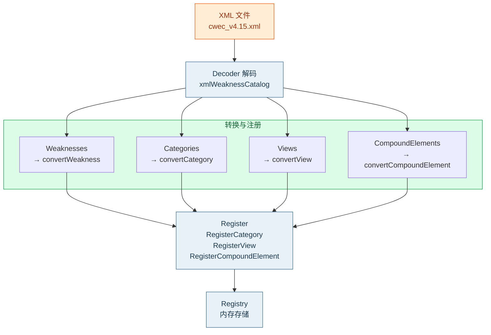

# 📥 XMLParser — MITRE CWE XML 解析器

`XMLParser` 解析 MITRE 官方发布的 CWE XML 目录文件（`cwec_vX.Y.xml`），将其反序列化为 [`Registry`](./model) 中的 `CWE`、`Category`、`View`、`CompoundElement` 条目。这是 SDK **离线模式**的关键组件——一次解析、本地常驻、零网络查询。

源文件：`xml_parser.go`。支持 MITRE CWE Schema 7.x 版本。

## 🧱 结构体定义

```go
type XMLParser struct{}
```

`XMLParser` 是零字段空结构体，无内部状态，可重复使用、并发安全。

## 🏗️ 构造函数

```go
func NewXMLParser() *XMLParser
```

无参数，返回 `*XMLParser`。

## 📤 解析入口

| 方法 | 签名 | 输入 | 文档 |
| --- | --- | --- | --- |
| `ParseFile` | `(path string) (*Registry, error)` | 文件路径 | [ParseFile](./xml-parse) |
| `Parse` | `(reader io.Reader) (*Registry, error)` | 任意 `io.Reader` | [Parse](./xml-parse) |
| `ParseBytes` | `(data []byte) (*Registry, error)` | 字节切片 | [Parse](./xml-parse) |

返回的 `*Registry` 已填入四类条目，可直接用于本地查询。

## 🔄 解析流程



1. 用 `encoding/xml` 的 `Decoder` 把 XML 解码到内部结构 `xmlWeaknessCatalog`。
2. 遍历 `Weaknesses` → `convertWeakness` → `registry.Register`。
3. 遍历 `Categories` → `convertCategory` → `registry.RegisterCategory`。
4. 遍历 `Views` → `convertView` → `registry.RegisterView`。
5. 遍历 `CompoundElements` → `convertCompoundElement` → `registry.RegisterCompoundElement`。
6. 重复注册的错误被静默忽略（`_ =`）。

::: tip 解析后即可离线查询
`ParseFile` 返回的 `Registry` 支持 `Get`、`Contains`、`GetByStatus` 等全部本地查询，无需再访问 API。配合 [`DataFetcher`](./data-fetcher) 可实现「先本地后远程」的混合策略。
:::

::: warning XML 文件体积较大
`cwec_v4.10.xml` 通常超过 20MB。解析会一次性载入内存，峰值内存占用与文件大小同量级。对内存敏感的环境建议用流式 `Parse(reader)` 配合自定义 Reader。
:::

## 🚀 可运行示例

```go
package main

import (
    "fmt"
    "log"

    "github.com/scagogogo/cwe-skills"
)

func main() {
    parser := cweskills.NewXMLParser()
    registry, err := parser.ParseFile("cwec_v4.10.xml")
    if err != nil {
        log.Fatal(err)
    }
    if w, ok := registry.Get(79); ok {
        fmt.Printf("CWE-79: %s\n", w.Name)
    }
}
```

## 📚 相关链接

- [NewXMLParser](./new-xml-parser) | [Parse / ParseFile](./xml-parse) | [Registry 模型](./model) | [DataFetcher](./data-fetcher)
